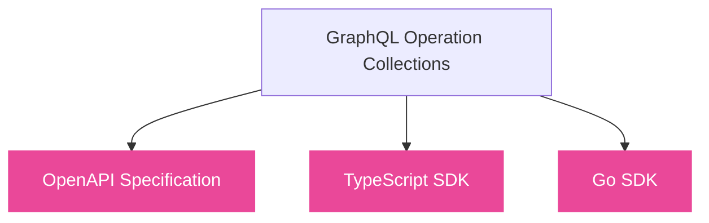
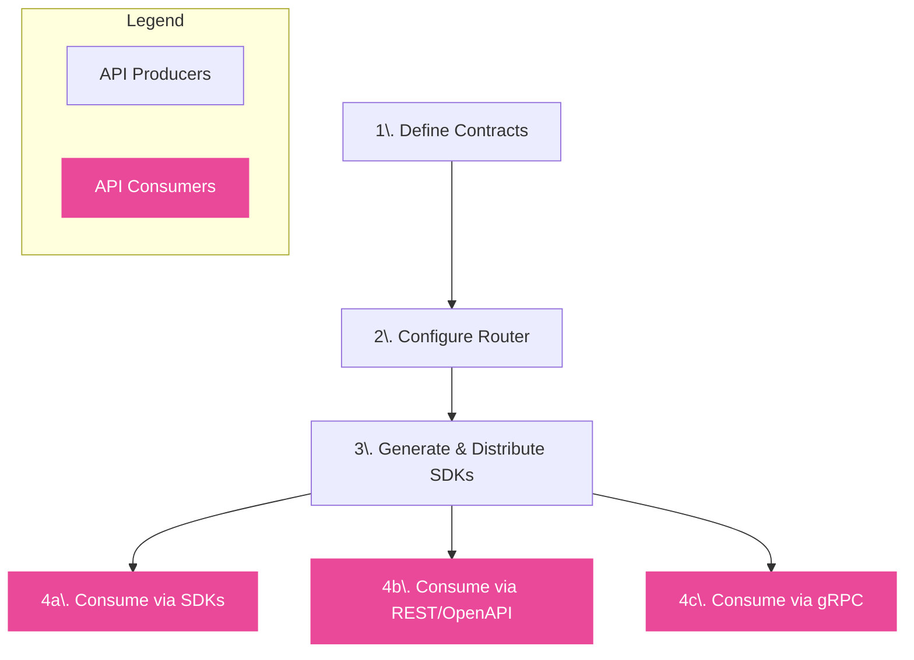

Cosmo ConnectRPC gives you the best of both worlds: the schema design and composition power of GraphQL with the universal reach of REST and type-safe SDKs. Define your API once as GraphQL operations, and let consumers interact through generated clients, standard HTTP endpoints, or high-performance gRPC — no GraphQL expertise required on the consumer side.

## From GraphQL Operations to Multiple Interfaces



The following example shows how a single `GetEmployeeById` GraphQL operation becomes consumable through multiple interfaces:

<Tabs>
  <Tab title="GraphQL Operation">
    The source GraphQL operation that defines the API contract:

    ```graphql
    query GetEmployeeById($id: Int!) {
      employee(id: $id) {
        id
        details {
          forename
          surname
        }
      }
    }
    ```
  </Tab>
  <Tab title="OpenAPI">
    Automatically generated OpenAPI specification:

    ```yaml
/employees.v1.HrService/GetEmployeeById:
      post:
        tags:
          - employees.v1.HrService
        summary: GetEmployeeById
        operationId: employees.v1.HrService.GetEmployeeById
        parameters:
          - name: Connect-Protocol-Version
            in: header
            required: true
            schema:
              $ref: '#/components/schemas/connect-protocol-version'
          - name: Connect-Timeout-Ms
            in: header
            schema:
              $ref: '#/components/schemas/connect-timeout-header'
        requestBody:
          content:
            application/json:
              schema:
                $ref: '#/components/schemas/employees.v1.GetEmployeeByIdRequest'
          required: true
        responses:
          default:
            description: Error
            content:
              application/json:
                schema:
                  $ref: '#/components/schemas/connect.error'
          "200":
            description: Success
            content:
              application/json:
                schema:
                  $ref: '#/components/schemas/employees.v1.GetEmployeeByIdResponse'
    ```
  </Tab>
  <Tab title="TypeScript SDK">
    Type-safe TypeScript client code:

    ```ts
    import { createClient } from "@connectrpc/connect";
    import { createConnectTransport } from "@connectrpc/connect-web";
    import { HrService } from "@my-org/sdk/employees/v1/service_connect";

    const transport = createConnectTransport({
      baseUrl: "http://localhost:5026",
    });

    const client = createClient(HrService, transport);

    // Request and response are fully typed
    const response = await client.getEmployeeById({ id: 1 });
    console.log(`Employee: ${response.employee?.details?.forename}`);
    ```
  </Tab>
  <Tab title="Go SDK">
    Type-safe Go client code:

    ```go
    import (
        "context"
        "connectrpc.com/connect"
        employeesv1 "github.com/my-org/sdk/gen/go/employees/v1"
        "github.com/my-org/sdk/gen/go/employees/v1/employeesv1connect"
    )

    client := employeesv1connect.NewHrServiceClient(
        http.DefaultClient,
        "http://localhost:5026",
    )

    req := connect.NewRequest(&employeesv1.GetEmployeeByIdRequest{
        Id: 1,
    })

    res, err := client.GetEmployeeById(context.Background(), req)
    // Response is strongly typed
    fmt.Printf("Employee: %s\n", res.Msg.Employee.Details.Forename)
    ```
  </Tab>
</Tabs>

### Why This Matters

While GraphQL is an excellent interface for schema design and composition, it is not universally consumable.

Many API consumers - due to existing tooling, security policies, performance requirements, or language ecosystems - rely on REST, RPC, or generated SDKs rather than constructing GraphQL queries directly.

Without a unified approach, platform teams often end up maintaining parallel APIs and duplicated contracts, leading to drift, inconsistent behavior, and higher operational overhead.

## Architectural Benefits

ConnectRPC addresses fundamental infrastructure and operational challenges by leveraging Protocol Buffers as the intermediate representation between GraphQL and consumption interfaces.

### Performance

Protocol Buffer encoding delivers significant efficiency gains over JSON-based GraphQL responses:

- **Compact wire format**: Binary serialization reduces payload sizes, lowering bandwidth consumption and improving response times
- **Optimized parsing**: Generated code eliminates runtime reflection and dynamic parsing overhead
- **HTTP caching**: GET-based queries enable standard HTTP caching layers and CDN integration

### Reliability

The architecture inherently improves system reliability through contract enforcement:

- **Schema-driven validation**: All requests are validated against compiled Protocol Buffer definitions before execution
- **Deterministic behavior**: <Tooltip tip="Pre-approved, named GraphQL operations registered with the system. Also known as persisted operations or persisted queries." href="/router/persisted-queries/persisted-operations">Trusted Documents</Tooltip> eliminate query variability, making performance characteristics predictable
- **Infrastructure observability**: Standard RPC semantics integrate with existing metrics, tracing, and monitoring infrastructure

### Operational Efficiency

The approach eliminates common sources of operational complexity:

- **No manual glue code**: The router handles protocol translation automatically—no custom ingress controllers, API gateways, or translation layers required
- **Single source of truth**: GraphQL operations define the contract once; all downstream artifacts are generated, not maintained
- **Breaking change detection**: Schema changes are validated against defined operations at compile time, surfacing incompatibilities before deployment
- **Reduced attack surface**: Only explicitly defined operations are exposed—arbitrary query construction is not possible at runtime

### API Abstraction

Consumers interact through stable, well-defined interfaces rather than raw query languages:

- **No exposed GraphQL**: API consumers use generated SDKs or standard REST/RPC calls—they never construct or see GraphQL queries
- **Implementation independence**: The underlying GraphQL layer becomes an internal implementation detail, not a public contract
- **Simplified onboarding**: Consumers integrate using familiar patterns (REST, gRPC, typed and generated clients) without GraphQL expertise

### Security Model

All API paths are explicitly bounded by design:

- **Enclosed execution paths**: Consumers can only invoke operations that have been pre-defined and compiled into the system
- **No query injection**: Unlike open GraphQL endpoints, there is no mechanism for clients to construct arbitrary queries
- **Auditable contracts**: Every exposed operation is traceable to a named, versioned definition in source control

## One API, Multiple Interfaces

The core concept of API Consumption in Cosmo is simple:

> GraphQL is your interface for design and governance; RPC and REST are your interfaces for consumption.

Platform teams define collections of <Tooltip tip="Pre-approved, named GraphQL operations registered with the system. Also known as persisted operations or persisted queries." href="/router/persisted-queries/persisted-operations">Trusted Documents</Tooltip> - named GraphQL queries and mutations that represent the supported API surface. 

```graphql
query GetUser($id: ID!) {
  user(id: $id) {
    id
    name
    email
  }
}
```

> This single `GetUser` operation becomes a versioned RPC method, a REST endpoint and a typed SDK function.

Cosmo compiles these into Protocol Buffer definitions, and the router acts as a mediation layer, automatically mapping incoming RPC or HTTP requests to these trusted operations against your graph.

This approach provides:

| Benefit | Before | After |
|---------|--------|-------|
| **Governance** | Arbitrary queries allowed in production | No arbitrary queries in production - only defined operations are exposed |
| **Type Safety** | Handwritten clients with runtime shape mismatches | No handwritten clients or runtime shape mismatches - strongly typed generated code |
| **Performance** | POST-only requests bypass HTTP caching | GET-based queries unlock HTTP caching and CDNs |

## How It Works

The lifecycle moves from GraphQL contract definition to multi-protocol consumption, without introducing additional API layers.



1. **Define Contracts**: Create named GraphQL operations (<Tooltip tip="Pre-approved, named GraphQL operations registered with the system. Also known as persisted operations or persisted queries." href="/router/persisted-queries/persisted-operations">Trusted Documents</Tooltip>) and compile them into Protocol Buffer definitions that act as stable, versioned API contracts.

2. **Configure Router**: Load the proto definitions into the Cosmo Router, which handles protocol translation automatically without server-side code.

3. **Generate &amp; Distribute SDKs**: Generate type-safe client SDKs (in languages like Go and TypeScript) and OpenAPI specifications from your definitions, ready for distribution.

4. **Consume**: Developers install generated SDKs or use standard HTTP clients to interact with the API in their preferred language and protocol.

## Supported Protocols and Clients

By defining your operations once, you can support a wide range of consumers:

- **REST / HTTP**: Simple JSON encoding over HTTP/1.1 or HTTP/2 for universal access via tools like curl.

- **OpenAPI/Swagger**: Automatically generated specifications for documentation and REST tooling integration.

- **Typed SDKs**: Generated client libraries for languages like TypeScript, Go, Swift, and Kotlin using standard tools like Buf.

- **gRPC**: High-performance binary protobuf over HTTP/2 for internal microservices.

- **Connect Protocol & gRPC-Web**: Browser-compatible RPC protocols.

All interfaces are generated from the same GraphQL operations and stay in sync by construction.

<Note> Hands-on Tutorial: The documentation in this section uses examples from our <a href="https://github.com/wundergraph/connectrpc-tutorial">ConnectRPC Tutorial Repository</a>. We recommend cloning it to follow along with the guides.  </Note>
