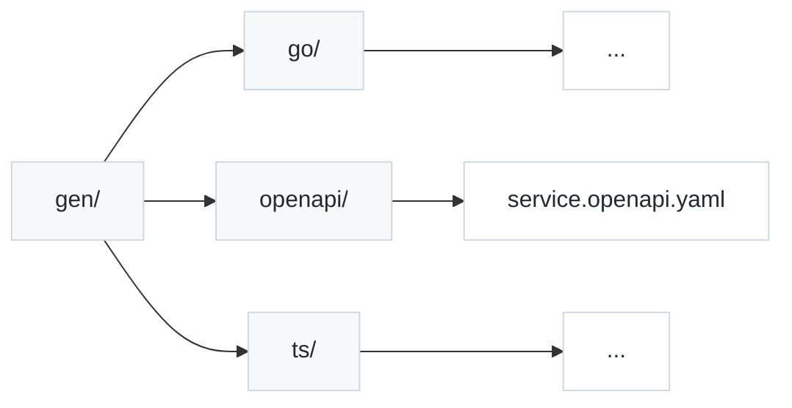

This page guides you through the "build step" of your API product. 
Once you have defined your contracts (operations and proto files), the next step is to generate the artifacts that your consumers need: type-safe client SDKs and documentation or API specs.

In a production environment, this generation process is typically automated as part of a Continuous Integration and Continuous Deployment (CI/CD) workflow. This ensures that whenever your API contracts change, your SDKs and documentation are automatically regenerated and distributed.

We recommend using [Buf](https://buf.build/), a modern toolchain for working with Protocol Buffers, to manage this process.

*Note: The examples on this page demonstrate setting up generators for **TypeScript** and **Go**, but the underlying workflow is the same for any language supported by the Buf ecosystem.*

## Recommendation: Local Generators

For the most robust and reproducible open-source workflow, we recommend using local generators.

While it is possible to use remote plugins hosted by the Buf Schema Registry (BSR), using local plugins ensures your build pipeline is self-contained, runs offline, and is not subject to external rate limiting for unauthenticated users.

This approach requires a one-time installation of the necessary generator plugins on your dev, build machine or CI environment.

## 1. Install Prerequisites

You need the Buf CLI and the specific language generator plugins installed locally in your development environment and on your CI/CD agents.

### Install Buf CLI

Follow the official [Buf installation guide](https://buf.build/docs/cli/installation/) for your OS.

### Install Generator plugins

Run the following commands to install the plugins for TypeScript, Go, and OpenAPI.

TypeScript/JavaScript (via npm):

```bash
npm install --save-dev @bufbuild/protoc-gen-es @connectrpc/protoc-gen-connect-es
```

Go & OpenAPI (via Go):

```bash
# Ensure $(go env GOPATH)/bin is in your $PATH
go install google.golang.org/protobuf/cmd/protoc-gen-go@latest
go install connectrpc.com/connect/cmd/protoc-gen-connect-go@latest
go install connectrpc.com/connect/cmd/protoc-gen-connect-openapi@latest
```

## 2. Configure Buf

Create two configuration files in the root of your project (next to your `services/` directory).

`buf.yaml` (Module Configuration)
This file defines your project as a Buf module. It configures linting rules to ensure your proto definitions follow best practices.

```yaml
version: v1
breaking:
  use:
    - FILE
lint:
  use:
    - DEFAULT
```

`buf.gen.yaml` (Generation Targets)

This file tells Buf which plugins to run and where to output the generated code.

<Note> Update the Go Package Path: Replace github.com/your-org/your-repo below with the actual module path for your Go project. This ensures imports work correctly in the generated Go code. </Note>

```yaml
version: v1
managed:
  enabled: true
  go_package_prefix:
    # TODO: Replace with your actual Go module path
    default: github.com/your-org/your-repo/gen/go
plugins:
  # --- TypeScript SDK ---
  # Generates base protobuf types
  - plugin: es
    out: gen/ts
    opt: target=ts
  # Generates ConnectRPC clients
  - plugin: connect-es
    out: gen/ts
    opt: target=ts

  # --- Go SDK ---
  # Generates base protobuf structs
  - plugin: go
    out: gen/go
    opt: paths=source_relative
  # Generates ConnectRPC interfaces/clients
  - plugin: connect-go
    out: gen/go
    opt: paths=source_relative

  # --- OpenAPI Spec ---
  # Generates openapi.yaml for documentation
  - plugin: connect-openapi
    out: gen/openapi
```

Because we installed the plugins locally, specifying just the plugin name (e.g. `plugin: es`) works because Buf finds the corresponding binary (e.g. `protoc-gen-es`) in your `$PATH` or `node_modules/.bin`.

## 3. Run Generation

Run the following command in your project root to generate all artifacts:

```bash
buf generate
```

Buf will discover the `.proto` files in your `services/` directory (based on the setup in Define Contracts) and run the configured plugins.

### Output Structure

You will see a new `gen/` directory with your distributable artifacts:



## 4. Distribution Strategy &amp; CI/CD Integration

Once these artifacts are generated, you need a strategy for distributing them to your consumers. This entire workflow should be automated within your CI/CD pipeline to run on every commit, merge or release.

### Strategy A: Monorepo (recommended for internal teams)

Best when producers and consumers are owned by the same organization.

Check the entire `gen/` directory into your version control system.

- CI/CD: Your CI pipeline should run `wgc grpc-service generate` followed by `buf generate` to ensure the `gen/` folder is always in sync with your operation definitions.

- Consumers: Your internal applications import the SDKs directly from the file path (e.g. `import from ../../packages/sdk/gen/ts`).

- Pros: Easiest setup, atomic updates across services and consumers.

### Strategy B: Polyrepo / Publishing

Best when APIs are consumed by external teams or third parties.

Do not check the `gen/` folder into version control. Instead, use CI/CD to generate and publish the artifacts.

- CI/CD: Your pipeline runs the generation commands and then publishes the output to package registries.

  - TypeScript: Publish `gen/ts` to npm as `@your-org/sdk`.

  - Go: Push `gen/go` to a separate Git repository that acts as a Go module.

  - OpenAPI: Upload `service.openapi.yaml` to your developer portal or host it on S3.

- Consumers: Use standard tools (`npm install, go get`) and semantic versioning.

- Pros: Decouples producers and consumers, standard versioning for public consumption.
