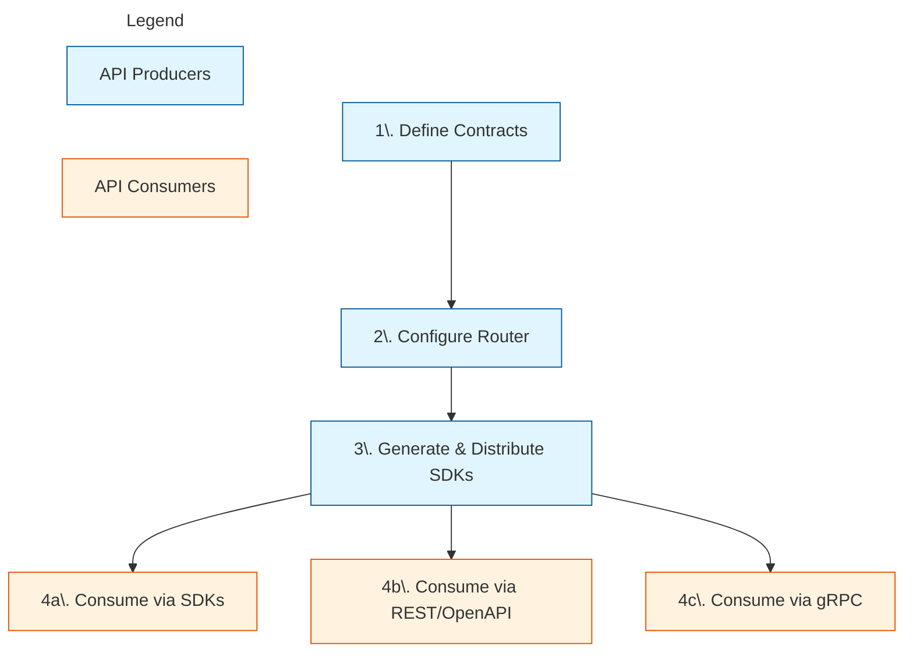

While GraphQL offers powerful composition for platform teams, it is not universally consumable. 

Many API consumers - due to legacy systems, security policies, or preference - rely on REST, RPC, or generated SDKs rather than constructing GraphQL queries.

Teams often solve this by maintaining parallel REST or RPC APIs, duplicating schemas, business logic, and validation - leading to drift, inconsistent behavior, and higher operational cost.

Cosmo ConnectRPC bridges this gap by letting platform teams to work with one authoritative API contract in GraphQL and automatically expose it as gRPC, REST, and typed SDKs - without writing or maintaining protocol-specific servers.

## One API, Multiple Interfaces

The core concept of API Consumption in Cosmo is simple:

> GraphQL is your interface for design and governance; RPC and REST are your interfaces for consumption.

Platform teams define collections of "Trusted Documents" - named GraphQL queries and mutations that represent the supported API surface. 

```graphql
query GetUser($id: ID!) {
  user(id: $id) {
    id
    name
    email
  }
}
```

> This single `GetUser` operation becomes a versioned RPC method, a REST endpoint and a typed SDK function.

Cosmo compiles these into Protocol Buffer definitions, and the router acts as a mediation layer, automatically mapping incoming RPC or HTTP requests to these trusted operations against your graph.

This approach provides:

| Benefit | Before | After |
|---------|--------|-------|
| **Governance** | Arbitrary queries allowed in production | No arbitrary queries in production - only defined operations are exposed |
| **Type Safety** | Handwritten clients with runtime shape mismatches | No handwritten clients or runtime shape mismatches - strongly typed generated code |
| **Performance** | POST-only requests bypass HTTP caching | GET-based queries unlock HTTP caching and CDNs |

## How It Works

The lifecycle moves from GraphQL contract definition to multi-protocol consumption, without introducing additional API layers.



1. **Define Contracts**: Create named GraphQL operations (Trusted Documents) and compile them into Protocol Buffer definitions that act as stable, versioned API contracts.

2. **Configure Router**: Load the proto definitions into the Cosmo Router, which handles protocol translation automatically without server-side code.

3. **Generate &amp; Distribute SDKs**: Generate type-safe client SDKs (in languages like Go and TypeScript) and OpenAPI specifications from your definitions, ready for distribution.

4. **Consume**: Developers install generated SDKs or use standard HTTP clients to interact with the API in their preferred language and protocol.

## Supported Protocols and Clients

By defining your operations once, you can support a wide range of consumers:

- **REST / HTTP**: Simple JSON encoding over HTTP/1.1 or HTTP/2 for universal access via tools like curl.

- **OpenAPI/Swagger**: Automatically generated specifications for documentation and REST tooling integration.

- **Typed SDKs**: Generated client libraries for languages like TypeScript, Go, Swift, and Kotlin using standard tools like Buf.

- **gRPC**: High-performance binary protobuf over HTTP/2 for internal microservices.

- **Connect Protocol & gRPC-Web**: Browser-compatible RPC protocols.

All interfaces are generated from the same GraphQL operations and stay in sync by construction.

<Note> Hands-on Tutorial: The documentation in this section uses examples from our <a href="https://github.com/wundergraph/connectrpc-tutorial">ConnectRPC Demo Repository</a>. We recommend cloning it to follow along with the guides.  </Note>
