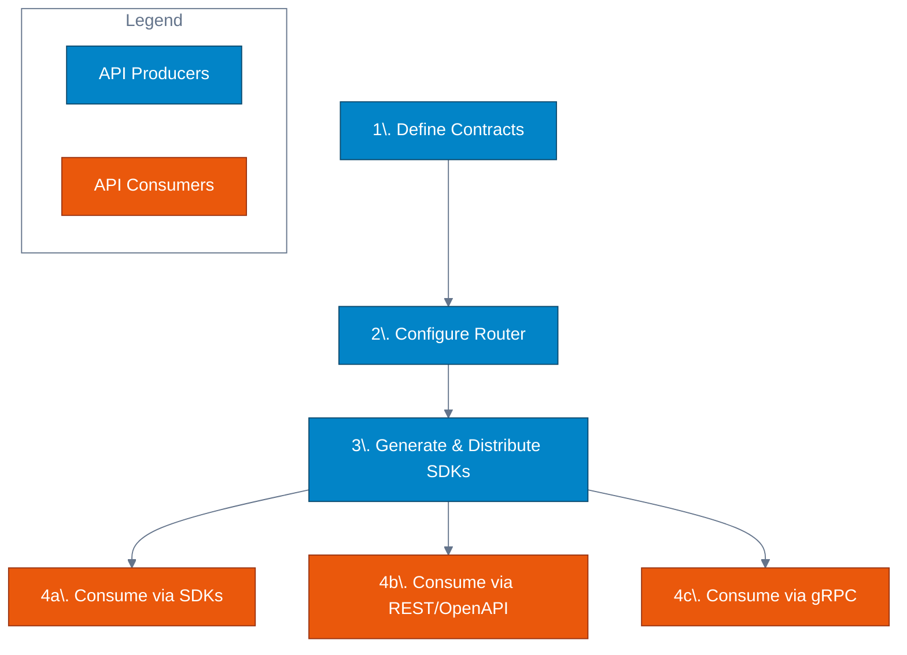

Cosmo Connect allows platform teams to define an API once in GraphQL and expose it through multiple consumption interfaces without writing adapters or duplicate servers.

The following example shows how the same `GetEmployeeById` GraphQL operation can be consumed in multiple ways - all generated from a single GraphQL operation.

<Tabs>
  <Tab title="GraphQL Operation">
    The source GraphQL operation that defines the API contract:

    ```graphql
    query GetEmployeeById($id: Int!) {
      employee(id: $id) {
        id
        details {
          forename
          surname
        }
      }
    }
    ```
  </Tab>
  <Tab title="OpenAPI">
    The automatically generated OpenAPI specification entry:

    ```yaml
    /employees.v1.HrService/GetEmployeeById:
      get:
        operationId: GetEmployeeById
        parameters:
          - name: id
            in: query
            required: true
            schema:
              type: integer
        responses:
          '200':
            description: Success
            content:
              application/json:
                schema:
                  type: object
                  properties:
                    employee:
                      type: object
    ```
  </Tab>
  <Tab title="curl">
    Standard HTTP request using curl:

    ```bash
    curl --get \
      --data-urlencode 'encoding=json' \
      --data-urlencode 'message={"id": 1}' \
      --data-urlencode 'connect=v1' \
      http://localhost:5026/employees.v1.HrService/GetEmployeeById
    ```
  </Tab>
  <Tab title="proto">
    The generated Protocol Buffer service definition:

    ```protobuf
    service HrService {
      rpc GetEmployeeById(GetEmployeeByIdRequest)
        returns (GetEmployeeByIdResponse) {
        option idempotency_level = NO_SIDE_EFFECTS;
      }
    }

    message GetEmployeeByIdRequest {
      int32 id = 1;
    }

    message GetEmployeeByIdResponse {
      Employee employee = 1;
    }
    ```
  </Tab>
  <Tab title="grpcurl">
    gRPC request using grpcurl:

    ```bash
    grpcurl -plaintext \
      -proto ./services/service.proto \
      -d '{"id": 1}' \
      localhost:5026 \
      employees.v1.HrService/GetEmployeeById
    ```
  </Tab>
  <Tab title="Go SDK">
    Type-safe Go client code:

    ```go
    import (
        "context"
        "connectrpc.com/connect"
        employeesv1 "github.com/my-org/sdk/gen/go/employees/v1"
        "github.com/my-org/sdk/gen/go/employees/v1/employeesv1connect"
    )

    client := employeesv1connect.NewHrServiceClient(
        http.DefaultClient,
        "http://localhost:5026",
    )

    req := connect.NewRequest(&employeesv1.GetEmployeeByIdRequest{
        Id: 1,
    })

    res, err := client.GetEmployeeById(context.Background(), req)
    // Response is strongly typed
    fmt.Printf("Employee: %s\n", res.Msg.Employee.Details.Forename)
    ```
  </Tab>
  <Tab title="TypeScript SDK">
    Type-safe TypeScript client code:

    ```ts
    import { createPromiseClient } from "@connectrpc/connect";
    import { createConnectTransport } from "@connectrpc/connect-web";
    import { HrService } from "@my-org/sdk/employees/v1/service_connect";

    const transport = createConnectTransport({
      baseUrl: "http://localhost:5026",
    });

    const client = createPromiseClient(HrService, transport);

    // Request and response are fully typed
    const response = await client.getEmployeeById({ id: 1 });
    console.log(`Employee: ${response.employee?.details?.forename}`);
    ```
  </Tab>
</Tabs>

### Why This Matters

While GraphQL is an excellent interface for schema design and composition, it is not universally consumable.

Many API consumers - due to existing tooling, security policies, performance requirements, or language ecosystems - rely on REST, RPC, or generated SDKs rather than constructing GraphQL queries directly.

Without a unified approach, platform teams often end up maintaining parallel APIs and duplicated contracts, leading to drift, inconsistent behavior, and higher operational overhead.

## One API, Multiple Interfaces

The core concept of API Consumption in Cosmo is simple:

> GraphQL is your interface for design and governance; RPC and REST are your interfaces for consumption.

Platform teams define collections of "Trusted Documents" - named GraphQL queries and mutations that represent the supported API surface. 

```graphql
query GetUser($id: ID!) {
  user(id: $id) {
    id
    name
    email
  }
}
```

> This single `GetUser` operation becomes a versioned RPC method, a REST endpoint and a typed SDK function.

Cosmo compiles these into Protocol Buffer definitions, and the router acts as a mediation layer, automatically mapping incoming RPC or HTTP requests to these trusted operations against your graph.

This approach provides:

| Benefit | Before | After |
|---------|--------|-------|
| **Governance** | Arbitrary queries allowed in production | No arbitrary queries in production - only defined operations are exposed |
| **Type Safety** | Handwritten clients with runtime shape mismatches | No handwritten clients or runtime shape mismatches - strongly typed generated code |
| **Performance** | POST-only requests bypass HTTP caching | GET-based queries unlock HTTP caching and CDNs |

## How It Works

The lifecycle moves from GraphQL contract definition to multi-protocol consumption, without introducing additional API layers.



1. **Define Contracts**: Create named GraphQL operations (Trusted Documents) and compile them into Protocol Buffer definitions that act as stable, versioned API contracts.

2. **Configure Router**: Load the proto definitions into the Cosmo Router, which handles protocol translation automatically without server-side code.

3. **Generate &amp; Distribute SDKs**: Generate type-safe client SDKs (in languages like Go and TypeScript) and OpenAPI specifications from your definitions, ready for distribution.

4. **Consume**: Developers install generated SDKs or use standard HTTP clients to interact with the API in their preferred language and protocol.

## Supported Protocols and Clients

By defining your operations once, you can support a wide range of consumers:

- **REST / HTTP**: Simple JSON encoding over HTTP/1.1 or HTTP/2 for universal access via tools like curl.

- **OpenAPI/Swagger**: Automatically generated specifications for documentation and REST tooling integration.

- **Typed SDKs**: Generated client libraries for languages like TypeScript, Go, Swift, and Kotlin using standard tools like Buf.

- **gRPC**: High-performance binary protobuf over HTTP/2 for internal microservices.

- **Connect Protocol & gRPC-Web**: Browser-compatible RPC protocols.

All interfaces are generated from the same GraphQL operations and stay in sync by construction.

<Note> Hands-on Tutorial: The documentation in this section uses examples from our <a href="https://github.com/wundergraph/connectrpc-tutorial">ConnectRPC Demo Repository</a>. We recommend cloning it to follow along with the guides.  </Note>
