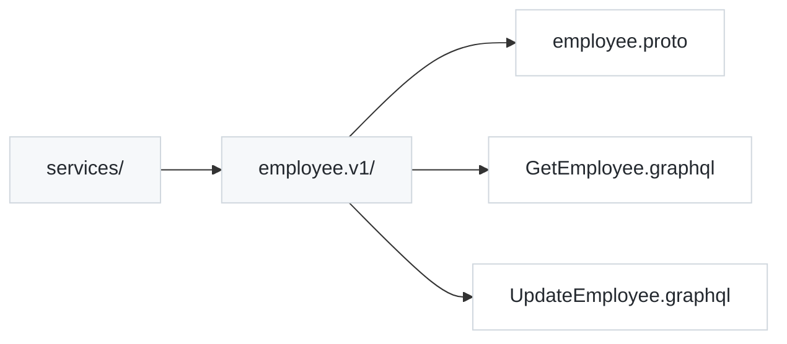
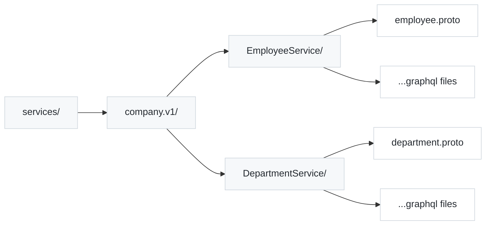
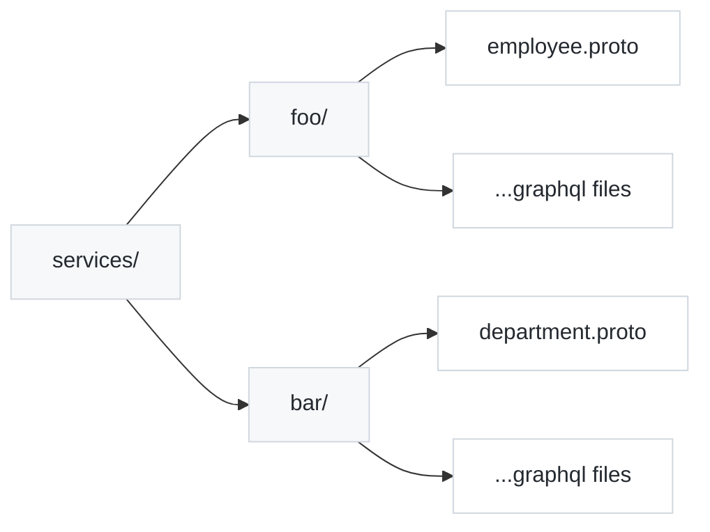
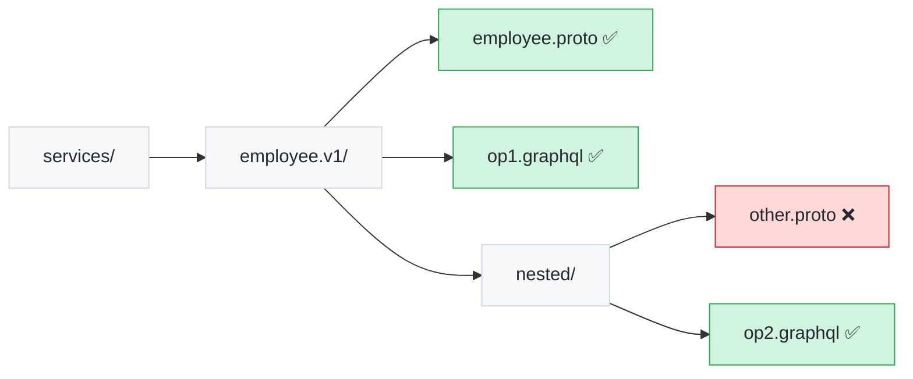

The first step in the producer workflow is to define the API contract. 

In Cosmo, this contract is not defined by creating `.proto` files directly. Instead, you define it by creating a collection of Trusted Documents - named GraphQL queries and mutations that represent your desired API surface.

These operations are then compiled into Protocol Buffer definitions that serve as the stable interface for your consumers.

## 1. Creating Trusted Documents

Trusted Documents are simply standard GraphQL operations saved in `.graphql` files. Each file should contain exactly one named operation.

Create a directory for your service operations (e.g. `services/`) and add your GraphQL files there.

### Rules for Mapping Operations to RPC Methods:

- One operation per file: Each `.graphql` file must contain only one operation.

- PascalCase Naming: The operation name must use PascalCase (e.g. `GetEmployeeById`). This name will become the RPC method name.

- No Root-Level Aliases: Aliases are not allowed at the root of the query, but nested aliases are permitted.

### Example operations

Query example `services/GetEmployeeById.graphql`

```graphql
query GetEmployeeById($id: Int!) {
  employee(id: $id) {
    id
    details {
      forename
      surname
    }
  }
}
```

Mutation example `services/UpdateEmployeeMood.graphql`

```graphql
mutation UpdateEmployeeMood($id: Int!, $mood: Mood!) {
  updateMood(employeeID: $id, mood: $mood) {
    id
    currentMood
    updatedAt
  }
}
```

## 2. Generating Proto Definitions

Once your operations are defined, use the `wgc` CLI to generate the corresponding Protocol Buffer service definition.

This process compiles your operations and schema into a `.proto` file that defines the services, methods and message types.

Run the following command from your project root:

```bash
wgc grpc-service generate \
  --input schema.graphql \
  --output ./services \
  --with-operations ./services \
  --package-name "employees.v1" \
  HRService
```

### Command Flags

- `--input`: The path to your federated graph's schema file (e.g. `schema.graphqls`).

- `--output`: The directory where the generated `.proto` and lock files will be saved.

- `--with-operations`: The directory containing your source `.graphql` operation files.

- `--package-name`: The protobuf package namespace. Use reverse domain notation and include a version (e.g., employees.v1).

- HRService: The name of the gRPC service to generate.

This command will generate two files in your output directory: `service.proto` and `service.proto.lock.json`.

### How mapping works

At a high level, each GraphQL operation is translated into a single RPC method with strongly typed request and response messages.

The generator automatically maps GraphQL concepts to protobuf:

| GraphQL        | Protobuf                    |
| -------------- | --------------------------- |
| Operation name | RPC method                  |
| Variables      | Request message             |
| Selection set  | Response message            |
| Scalar types   | Protobuf scalar equivalents |

- Query operations are marked with an `idempotency_level = NO_SIDE_EFFECTS` option, enabling support for HTTP GET requests.

## 3. Organizing Multiple Services

The Cosmo Router supports serving multiple gRPC services and packages simultaneously. It achieves this by recursively walking the directory specified in your router configuration to discover `.proto` files and their associated `.graphql` operations.

Because discovery is recursive and based on the package declaration within the generated `.proto` files, you have flexibility in how you organize your directories.

### Standard Package Organization

A common pattern is to organize services by their package name.

Example: Single Service per Package



Example: Multiple Services per Package You can group multiple services that share the same proto package into subdirectories.



### Flexible Organization

Since the router relies on the package declaration in the proto file and not the directory name, you can organize directories for convenience.



#### Important: Nested Discovery Rules

While the router searches recursively, it has a specific rule regarding nested proto files: Nested proto files are not discovered if a parent directory already contains a proto file.

Once the router finds a .proto file in a directory, it stops searching deeper in that specific branch.



**Key:**
- ✅ **Green files**: Discovered and used
- ❌ **Red files**: Not discovered (parent directory already contains a proto file)

## 4. Versioning &amp; Stability

Versioning and compatibility are handled automatically so you can safely evolve your API without manually managing protobuf field numbers.

> **You usually don’t need to think about this.**  
> The lock file exists to guarantee compatibility automatically as your API evolves.

A critical part of maintaining a gRPC, or any API, is ensuring forward compatibility for your clients. This means that as you evolve your GraphQL schema and operations, existing clients must continue to work.

The `wgc grpc-service generate` command manages this automatically using a lock file.

### The `service.proto.lock.json` file

When you generate your proto definitions for the first time a `service.proto.lock.json` file is created alongside the `.proto` file. 

This file records the unique field numbers assigned to every field in your protobuf messages.

You should commit this file to version control.

On subsequent runs, the generator reads this lock file to ensure that:

- existing fields retain their assigned numbers.

- new fields are assigned new, unused numbers.

- removed fields have their numbers marked as "reserved" so that they are not reused.

### How it works

The lock file tracks field numbers using the full, dot-notation path of nested messages.

This ensures that fields in different messages with the same name (e.g. `Details` for User vs Details for Product) are tracked independently.

#### Example 1: Stable Field Numbers

Adding fields is always safe.
New fields get new numbers; existing fields keep theirs.

```diff
 "fields": {
   "name": 1,
   "email": 2
+  "phone": 3
 }
```

This behavior guarantees that an old client that only knows about fields 1 and 2 can still communicate with a new server that also sends field 3.

#### Example 2: Handling Removed Fields

Removing fields is safe.
Removed field numbers are reserved and never reused.

```diff
 "fields": {
   "name": 1,
-  "email": 2,
   "phone": 3
-}
+},
+"reservedNumbers": [
+  2
+]
```

This is critical for backward compatibility. If an old client sends data with field number 2, the new server will correctly ignore it as a reserved field, rather than mistakenly trying to parse it as a new, unrelated field that happened to get assigned number 2.

### Deeply Nested Messages (advanced)

You don't need to manage this manually.

The locking mechanism works regardless of nesting depth. It uses full paths like `GetDeepResponse.GetDeep.Level2.Level3.Level4.Level5` to uniquely identify every message scope, ensuring precise control over field numbering throughout your entire API surface.

### Best Practices

1. Commit the lock file: Always commit service.proto.lock.json to your version control system along with your .graphql and .proto files.

2. Do not edit manually: Never manually modify or delete the lock file. Let the wgc CLI manage it.

3. Generate on CI: Run the generation step as part of your CI/CD pipeline to ensure the lock file is always up-to-date with your operations.

By following these practices, you can safely evolve your GraphQL-backed gRPC API without breaking existing clients.
