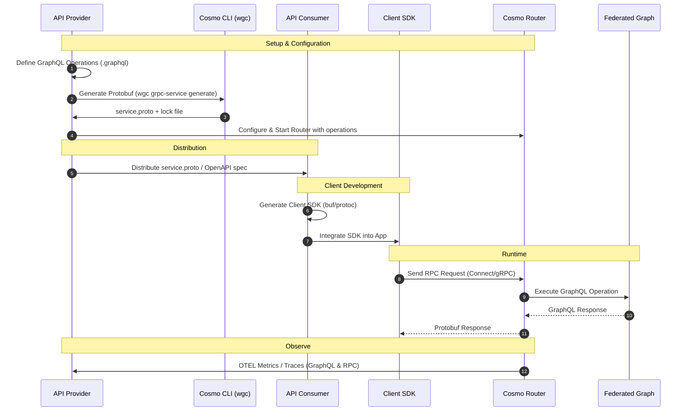

# Connect Client

<Warning>
  **Alpha Feature**: The Connect Client capability is currently in alpha. APIs and functionality may change as we gather feedback.
</Warning>

Connect Client enables you to generate type-safe gRPC/Connect clients and OpenAPI specifications directly from your GraphQL operations. This allows you to consume your Federated (or monolithic) Graph using standard gRPC tooling in any language, or expose REST APIs via OpenAPI without writing manual adapters.

## Overview

While **Connect gRPC Services** (gRPC Subgraphs) focuses on implementing subgraphs using gRPC, **Connect Client** focuses on the consumer side. It allows you to define GraphQL operations (Queries, Mutations and soon Subscriptions) and compile them into a Protobuf service definition.

The Cosmo Router acts as a bridge. It serves your generated operations via the Connect protocol, executes them against your Federated Graph, and maps the GraphQL response back to typed Protobuf messages.

## Workflow

The typical workflow involves defining your operations, configuring the Router to serve them, and then distributing the Protobuf or OpenAPI definition to consumers who generate their client SDKs.



## Usage Example

### 1. Define GraphQL Operations

Create a directory for your operations, e.g., `operations/`:

```graphql operations/GetEmployee.graphql
query GetEmployee($id: ID!) {
  employee(id: $id) {
    id
    details {
      forename
      surname
    }
  }
}
```

### 2. Generate Protobuf

Run the `wgc grpc-service generate` command with the `--with-operations` flag. You must also provide the schema SDL to validate the operations.

<Note>
  Each collection of operations represents a distinct Protobuf service. You can organize your operations into different directories (packages) to create multiple services, giving you the flexibility to expose specific subsets of your graph to different consumers or applications.
</Note>

<Tip>
  It is recommended to output the generated proto file to the same directory as your operations to keep them together.
</Tip>

```bash
wgc grpc-service generate \
  --input schema.graphql \
  --output ./operations \
  --with-operations ./operations \
  --package-name "myorg.employee.v1" \
  MyService
```

This command generates a `service.proto` file and a `service.proto.lock.json` file in the `./operations` directory.

### 3. Configure and Start Router

Enable the ConnectRPC server in your `config.yaml` and point the `services` provider to the directory containing your generated `service.proto`.

```yaml config.yaml
# ConnectRPC configuration
connect_rpc:
  enabled: true
  server:
    listen_addr: "0.0.0.0:8081"
  services_provider_id: "fs-services"

# Storage providers for services directory
storage_providers:
  file_system:
    - id: "fs-services"
      # Path to the directory containing your generated service.proto and operations
      path: "./operations" 
```

Start the router. It is now ready to accept requests for the operations defined in `service.proto`.

### 4. Generate Client SDK

Use [buf](https://buf.build/) or `protoc` to generate the client code for your application.

Example `buf.gen.yaml` for Go:

```yaml buf.gen.yaml
version: v1
plugins:
  - plugin: buf.build/connectrpc/go
    out: gen/go
    opt: paths=source_relative
  - plugin: buf.build/protocolbuffers/go
    out: gen/go
    opt: paths=source_relative
```

Run the generation:

```bash
buf generate operations/service.proto
```

### 5. Use the Client

You can now use the generated client to call your GraphQL API via the Router. The Router acts as the server implementation for your generated service.

```go
package main

import (
    "context"
    "net/http"
    "log"
    
    "connectrpc.com/connect"
    employeev1 "example/gen/go/myorg/employee/v1"
    "example/gen/go/myorg/employee/v1/employeev1connect"
)

func main() {
    // Point to your Cosmo Router's ConnectRPC listener
    client := employeev1connect.NewMyServiceClient(
        http.DefaultClient,
        "http://localhost:8081",
    )

    req := connect.NewRequest(&employeev1.GetEmployeeRequest{
        Id: "1",
    })

    resp, err := client.GetEmployee(context.Background(), req)
    if err != nil {
        log.Fatal(err)
    }

    log.Printf("Employee: %s %s", 
        resp.Msg.Employee.Details.Forename,
        resp.Msg.Employee.Details.Surname,
    )
}
```

## Observability

The Cosmo Router provides built-in [observability features](/router/metrics-and-monitoring) that work seamlessly with Connect Client. Because the Router translates RPC calls into GraphQL operations, you get detailed metrics and tracing for both layers.

- **GraphQL Metrics**: Track the performance, error rates, and usage of your underlying GraphQL operations (`GetEmployee`, etc.).
- **Request Tracing**: Trace the entire flow from the incoming RPC request, through the GraphQL engine, to your subgraphs and back.
- **Standard Protocols**: Export data using OpenTelemetry (OTLP) or Prometheus to your existing monitoring stack (Grafana, Datadog, Cosmo Cloud, etc.).

Since the Router is aware of the operation mapping, it can attribute metrics correctly to the specific GraphQL operation being executed, giving you full visibility into your client's usage patterns.

## Forward Compatibility & Lock Files

When you generate your Protobuf definition, the CLI creates a `service.proto.lock.json` file. **You should commit this file to your version control system.**

This lock file maintains a history of your operations and their field assignments. When you modify your operations (e.g., add new fields, reorder fields, or add new operations), the CLI uses the lock file to ensure:

1.  **Stable Field Numbers**: Existing fields retain their unique Protobuf field numbers, even if you reorder them in the GraphQL query.
2.  **Safe Evolution**: You can safely evolve your client requirements without breaking existing clients.

This mechanism allows you to iterate on your GraphQL operations—adding data requirements or new features—while maintaining binary compatibility for deployed clients.

## Roadmap

The following features are planned for future releases of Connect Client:

1.  **OpenAPI Generation**: Enhanced support for generating OpenAPI specifications including descriptions, summaries, deprecated fields, and tags.
2.  **Subscription Support**: Ability to consume GraphQL subscriptions as gRPC streams, enabling real-time data updates over the Connect protocol.
3.  **Multiple Root Fields**: Support for executable operations containing multiple root selection set fields, allowing more complex queries in a single operation.
4.  **Field Aliases**: Support for GraphQL aliases to control the shape of the API surface, enabling customized field names in the generated Protobuf definitions.
