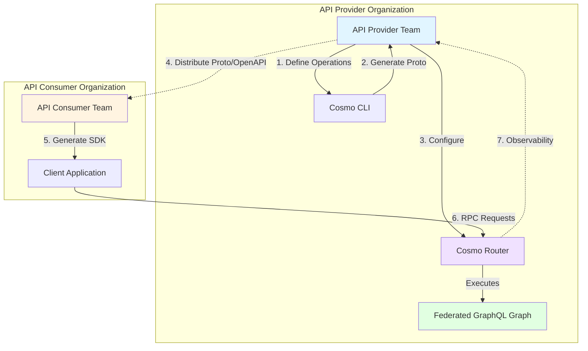
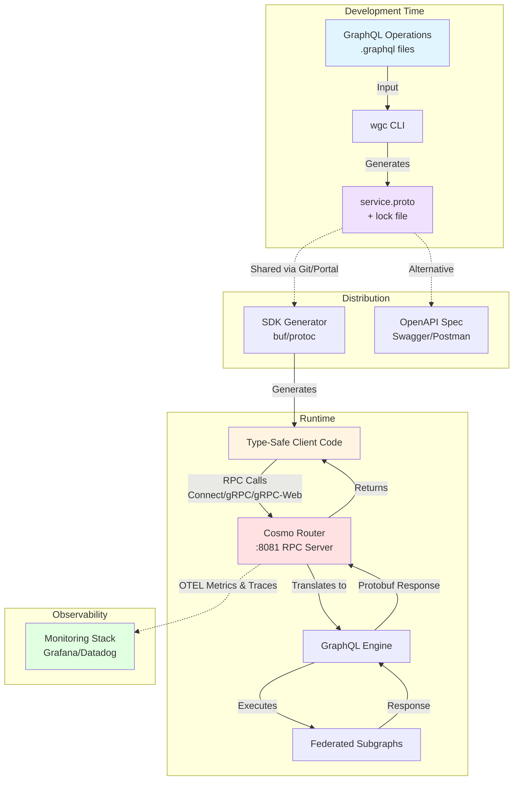
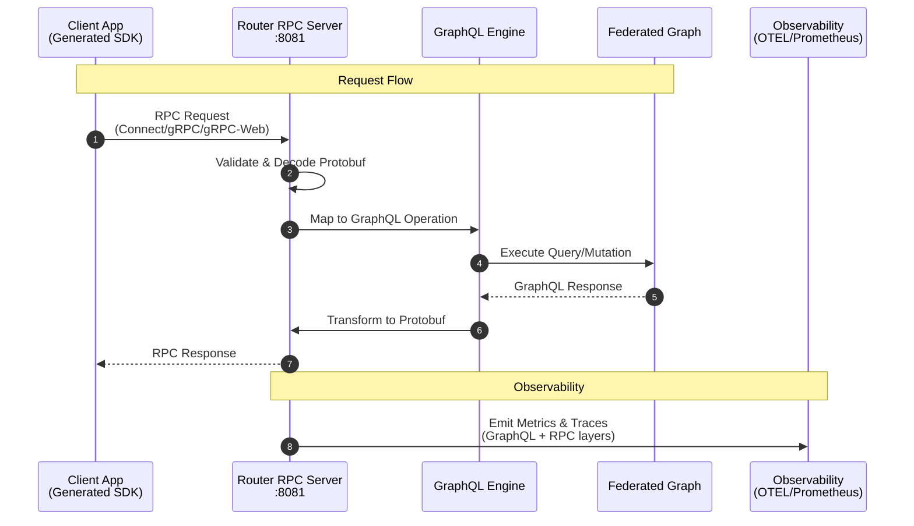

# Connect RPC

<Warning>
  **Alpha Feature**: The Connect RPC capability is currently in alpha. APIs and functionality may change as we gather feedback.
</Warning>

Connect RPC enables you to generate type-safe gRPC/Connect clients and OpenAPI specifications directly from your
GraphQL operations. This allows you to consume your Federated (or monolithic) Graph using standard gRPC tooling in any
language, or expose REST APIs via OpenAPI without writing manual adapters.

## What is ConnectRPC?

ConnectRPC enables Platform Engineering (platform teams) to distribute GraphQL-backed APIs as governed, versioned API
products using protobuf.

## How does ConnectRPC work?

ConnectRPC turns GraphQL APIs into distributable, protocol-agnostic API products by introducing a clear, governed workflow:

1. **Define GraphQL Operations (Trusted Documents)**

API Providers define a fixed set of GraphQL queries and mutations that represent the supported API surface.

2. **Generate Protobuf Service Definitions**

Using the wgc CLI, convert GraphQL operations into protobuf service definitions.

3. **Distribute as Versioned API Products**

Distribute OpenAPI and proto files via Git, your developer portal, or schema registry of your choice to enable API
consumers to generate type-safe clients in their favourite language.

## Architecture & Workflow

### System Context

ConnectRPC enables API providers to expose GraphQL operations as type-safe RPC services that consumers can integrate using standard gRPC/Connect tooling.



### Container View

This diagram shows how the Cosmo Router acts as a protocol bridge between RPC clients and your GraphQL federation.



### Component Interaction

This detailed view shows the complete request flow from client to federated graph and back.



### Key Phases

The ConnectRPC workflow consists of three main phases:

1. **Setup Phase** (API Provider)
   - Define GraphQL operations as `.graphql` files
   - Generate Protobuf definitions using `wgc grpc-service generate`
   - Configure Router with generated proto and operations

2. **Distribution Phase** (Provider → Consumer)
   - Share `service.proto` via Git, developer portal, or schema registry
   - Optionally generate and share OpenAPI specifications
   - Consumers generate type-safe client SDKs in their language

3. **Runtime Phase** (Consumer)
   - Client applications make RPC calls using generated SDKs
   - Router translates RPC requests to GraphQL operations
   - Router returns responses in Protobuf format
   - Full observability across both RPC and GraphQL layers

## Usage Example

### 1. Define GraphQL Operations

Create a directory for your operations, e.g., `services/`:

```graphql services/GetEmployee.graphql
query GetEmployee($id: ID!) {
  employee(id: $id) {
    id
    details {
      forename
      surname
    }
  }
}
```

### 2. Generate Protobuf

Run the `wgc grpc-service generate` command with the `--with-operations` flag. You must also provide the schema SDL to validate the operations.

<Note>
  Each collection of operations represents a distinct Protobuf service. You can organize your operations into different directories (packages) to create multiple services, giving you the flexibility to expose specific subsets of your graph to different consumers or applications.
</Note>

<Tip>
  It is recommended to output the generated proto file to the same directory as your operations to keep them together.
</Tip>

```bash
wgc grpc-service generate \
  --input schema.graphql \
  --output ./services \
  --with-operations ./services \
  --package-name "myorg.employee.v1" \
  MyService
```

This command generates a `service.proto` file and a `service.proto.lock.json` file in the `./services` directory.

#### Command Options

| Option | Description | Default |
|--------|-------------|---------|
| `-i, --input <path>` | **(Required)** GraphQL schema file (SDL) | - |
| `-w, --with-operations <path>` | **(Required for ConnectRPC)** Directory containing GraphQL operation files (`.graphql`, `.gql`, `.graphqls`, `.gqls`). Each operation becomes an RPC method | - |
| `-o, --output <path>` | Output directory for generated files | `.` |
| `-p, --package-name <name>` | Proto package name | `service.v1` |
| `-g, --go-package <name>` | Adds `option go_package` to proto file | - |
| `-l, --proto-lock <path>` | Path to proto lock file for field number stability | `<output>/service.proto.lock.json` |
| `--custom-scalar-mapping <json>` | Custom scalar mappings as JSON string | - |
| `--custom-scalar-mapping-file <path>` | Path to JSON file with custom scalar mappings | - |
| `--max-depth <number>` | Maximum recursion depth for nested selections/fragments | `50` |

#### How It Works

ConnectRPC uses **operations-based generation** (enabled with the `-w` flag):

- Generates proto from GraphQL operation files (queries, mutations, subscriptions)
- Each operation becomes an RPC method in the service
- Operation files are processed recursively from the specified directory
- Files are sorted alphabetically for deterministic output
- **Query operations automatically marked with `NO_SIDE_EFFECTS` idempotency level**
- Subscriptions marked as server streaming RPCs
- Generates `service.proto` and `service.proto.lock.json`

#### Important Requirements

<Warning>
**Operation Naming**: Operation names must be in PascalCase (e.g., `GetEmployeeById`, `UpdateEmployeeMood`). This ensures exact matching between GraphQL operation names and RPC method names.

- ❌ Invalid: `get_employee`, `GETEMPLOYEE`, `getEmployee`
- ✅ Valid: `GetEmployee`, `CreatePost`, `OnMessageAdded`
</Warning>

<Warning>
**One Operation Per File**: Each `.graphql` file must contain exactly one named operation. This is required for deterministic proto schema generation. Multiple operations in a single file will cause an error.
</Warning>

<Warning>
**No Root-Level Aliases**: Field aliases at the root level are not supported as they break proto schema generation consistency (each GraphQL field must map to exactly one proto field name). Aliases on nested fields are allowed.
</Warning>

### 3. Configure and Start Router

Enable the ConnectRPC server in your `config.yaml` and point the `services` provider to the directory containing your generated `service.proto`.

```yaml config.yaml
# ConnectRPC configuration
connect_rpc:
  enabled: true
  server:
    listen_addr: "0.0.0.0:8081"
  services_provider_id: "fs-services"

# Storage providers for services directory
storage_providers:
  file_system:
    - id: "fs-services"
      # Path to the directory containing your generated service.proto and operations
      path: "./services" 
```

Start the router. It is now ready to accept requests for the operations defined in `service.proto`.

### 4. Generate Client SDK

Use [buf](https://buf.build/) or `protoc` to generate the client code for your application.

#### Understanding buf.gen.yaml

The `buf.gen.yaml` file configures code generation from proto files. Here's what each section does:

- **`version: v2`** - Uses Buf v2 configuration format
- **`managed.enabled: true`** - Enables managed mode for consistent code generation
- **`managed.override`** - Customizes generation options (e.g., Go module path prefix)
- **`plugins`** - Defines code generators to run:
  - `local` - Uses locally installed plugin
  - `remote` - Uses Buf Schema Registry plugins
  - `out` - Output directory for generated code
  - `opt` - Plugin-specific options

#### Language-Specific Examples

<Tabs>
  <Tab title="TypeScript/JavaScript">
```bash
# Install dependencies
npm install @bufbuild/protoc-gen-es @connectrpc/protoc-gen-connect-es

# Create buf.gen.yaml
cat > buf.gen.yaml << EOF
version: v2
plugins:
  - local: ./node_modules/.bin/protoc-gen-es
    out: gen/ts
    opt: target=ts
  - local: ./node_modules/.bin/protoc-gen-connect-es
    out: gen/ts
    opt: target=ts
EOF

# Generate
buf generate services/service.proto
```
  </Tab>

  <Tab title="Go">
```bash
# Install dependencies
go install google.golang.org/protobuf/cmd/protoc-gen-go@latest
go install connectrpc.com/connect/cmd/protoc-gen-connect-go@latest

# Create buf.gen.yaml
cat > buf.gen.yaml << EOF
version: v2
managed:
  enabled: true
  override:
    - file_option: go_package_prefix
      value: github.com/yourorg/yourproject/gen/go
plugins:
  - local: protoc-gen-go
    out: gen/go
    opt: paths=source_relative
  - local: protoc-gen-connect-go
    out: gen/go
    opt: paths=source_relative
EOF

# Generate
buf generate services/service.proto
```
  </Tab>

  <Tab title="Swift (iOS)">
```bash
# Add to Package.swift:
# .package(url: "https://github.com/apple/swift-protobuf.git", from: "1.25.0")
# .package(url: "https://github.com/connectrpc/connect-swift.git", from: "0.12.0")

# Create buf.gen.yaml
cat > buf.gen.yaml << EOF
version: v2
plugins:
  - remote: buf.build/apple/swift
    out: gen/swift
  - remote: buf.build/connectrpc/swift
    out: gen/swift
EOF

# Generate
buf generate services/service.proto
```
  </Tab>

  <Tab title="Kotlin (Android)">
```bash
# Create buf.gen.yaml
cat > buf.gen.yaml << EOF
version: v2
plugins:
  - remote: buf.build/grpc/kotlin
    out: gen/kotlin
  - remote: buf.build/connectrpc/kotlin
    out: gen/kotlin
EOF

# Generate
buf generate services/service.proto
```
  </Tab>

  <Tab title="Python">
```bash
# Install dependencies
pip install grpcio-tools

# Using protoc directly
protoc --python_out=gen/python \
  --grpc_python_out=gen/python \
  services/service.proto

# Or using buf
cat > buf.gen.yaml << EOF
version: v2
plugins:
  - remote: buf.build/protocolbuffers/python
    out: gen/python
  - remote: buf.build/grpc/python
    out: gen/python
EOF

buf generate services/service.proto
```
  </Tab>
</Tabs>

#### Generate OpenAPI Specification

Generate OpenAPI 3.0 specification for REST-like documentation and tooling:

```bash
# Install the OpenAPI plugin
go install connectrpc.com/connect/cmd/protoc-gen-connect-openapi@latest

# Create buf.gen.yaml for OpenAPI
cat > buf.gen.yaml << EOF
version: v2
plugins:
  - local: protoc-gen-connect-openapi
    out: gen/openapi
    opt:
      - format=yaml
EOF

# Generate
buf generate services/service.proto
```

**Use the generated OpenAPI specification with:**

- **Swagger UI** - Interactive API documentation
- **Postman** - API testing and collaboration
- **Redoc** - Beautiful API documentation
- **Speakeasy** - Advanced SDK generation with retry logic, pagination, etc.
- **Stainless** - Production-grade SDK generation

### 5. Use the Client

You can now use the generated client to call your GraphQL API via the Router. The Router acts as the server implementation for your generated service.

<Tabs>
  <Tab title="TypeScript">
```typescript
import { createPromiseClient } from "@connectrpc/connect";
import { createConnectTransport } from "@connectrpc/connect-web";
import { EmployeeService } from "./gen/employee/v1/service_connect";

// Create transport
const transport = createConnectTransport({
  baseUrl: "http://localhost:8081",
});

// Create client
const client = createPromiseClient(EmployeeService, transport);

// Make request
const response = await client.getEmployee({
  id: "1",
});

console.log(response.employee?.details?.forename); // "John"
```
  </Tab>

  <Tab title="Go">
```go
package main

import (
    "context"
    "net/http"
    "log"
    
    "connectrpc.com/connect"
    employeev1 "example/gen/go/myorg/employee/v1"
    "example/gen/go/myorg/employee/v1/employeev1connect"
)

func main() {
    // Point to your Cosmo Router's ConnectRPC listener
    client := employeev1connect.NewMyServiceClient(
        http.DefaultClient,
        "http://localhost:8081",
    )

    req := connect.NewRequest(&employeev1.GetEmployeeRequest{
        Id: "1",
    })

    resp, err := client.GetEmployee(context.Background(), req)
    if err != nil {
        log.Fatal(err)
    }

    log.Printf("Employee: %s %s",
        resp.Msg.Employee.Details.Forename,
        resp.Msg.Employee.Details.Surname,
    )
}
```
  </Tab>

  <Tab title="Swift">
```swift
import Connect

let client = ProtocolClient(
    httpClient: URLSessionHTTPClient(),
    config: ProtocolClientConfig(
        host: "http://localhost:8081",
        networkProtocol: .connect
    )
)

let request = Employee_V1_GetEmployeeRequest.with {
    $0.id = "1"
}

let response = try await client.getEmployee(request: request)
print(response.employee.details.forename) // "John"
```
  </Tab>

  <Tab title="Kotlin">
```kotlin
import com.connectrpc.ProtocolClient
import employee.v1.EmployeeServiceClient

val client = ProtocolClient(
    httpClient = OkHttpClient(),
    ProtocolClientConfig(
        host = "http://localhost:8081",
        serializationStrategy = ProtobufStrategy()
    )
)

val employeeClient = EmployeeServiceClient(client)

val request = GetEmployeeRequest.newBuilder()
    .setId("1")
    .build()

val response = employeeClient.getEmployee(request)
println(response.employee.details.forename) // "John"
```
  </Tab>
</Tabs>

## Protocol Support

ConnectRPC supports multiple protocols and formats with automatic transcoding, allowing clients to use their preferred
protocol while the Router handles translation to GraphQL operations.

### Supported Protocols

#### 1. Connect Protocol with JSON

The Connect protocol is modern, efficient, and works over HTTP/1.1 or HTTP/2. The `Connect-Protocol-Version` header is optional.

**POST Request:**
```bash
curl -X POST http://localhost:8081/employee.v1.EmployeeService/GetEmployee \
  -H "Content-Type: application/json" \
  -H "Connect-Protocol-Version: 1" \
  -d '{"id": "1"}'
```

**GET Request (for queries - enables CDN caching):**
```bash
curl --get \
  --data-urlencode 'encoding=json' \
  --data-urlencode 'message={"id":"1"}' \
  http://localhost:8081/employee.v1.EmployeeService/GetEmployee
```

#### 2. gRPC Protocol

Binary protobuf over HTTP/2 for maximum efficiency.

```bash
grpcurl -plaintext \
  -proto ./services/service.proto \
  -d '{"id": "1"}' \
  localhost:8081 \
  employee.v1.EmployeeService/GetEmployee
```

#### 3. gRPC-Web Protocol

Browser-compatible gRPC with binary protobuf.

```bash
buf curl --protocol grpcweb \
  --schema ./services/service.proto \
  --data '{"id": "1"}' \
  http://localhost:8081/employee.v1.EmployeeService/GetEmployee
```

### Key Features

- **JSON Support**: All protocols support JSON encoding—no binary proto required
- **GET for Queries**: Query operations can use HTTP GET with `encoding` and `message` query parameters, enabling CDN caching for better performance
- **POST for Mutations**: Mutation operations must use HTTP POST
- **Flexible Headers**: The `Connect-Protocol-Version` header is optional for Connect protocol requests

## Directory Structure & Organization

The Cosmo Router uses a convention-based directory structure to automatically discover and load Connect RPC services. This approach co-locates proto files with their GraphQL operations for easy management.

### Configuration

Configure the router to point to your root services directory using a storage provider:

```yaml config.yaml
connect_rpc:
  enabled: true
  server:
    listen_addr: "0.0.0.0:8081"
  services_provider_id: "fs-services"

storage_providers:
  file_system:
    - id: "fs-services"
      path: "./services"  # Root services directory
```

The router will recursively walk the `services` directory and automatically discover all proto files and their associated GraphQL operations.

### Recommended Structure

For organization purposes, we recommend keeping all services in a root `services` directory, with subdirectories for packages and individual services.

#### Single Service per Package

When you have one service per package, you can organize files directly in the package directory:

```
services/
└── employee.v1/              # Package directory
    ├── employee.proto        # Proto definition
    ├── employee.proto.lock.json
    ├── GetEmployee.graphql   # Operation files
    ├── UpdateEmployee.graphql
    └── DeleteEmployee.graphql
```

Or with operations in a subdirectory:

```
services/
└── employee.v1/
    ├── employee.proto
    ├── employee.proto.lock.json
    └── operations/
        ├── GetEmployee.graphql
        ├── UpdateEmployee.graphql
        └── DeleteEmployee.graphql
```

#### Multiple Services per Package

When multiple services share the same proto package, organize them in service subdirectories:

```
services/
└── company.v1/                    # Package directory
    ├── EmployeeService/           # First service
    │   ├── employee.proto         # package company.v1; service EmployeeService
    │   ├── employee.proto.lock.json
    │   └── operations/
    │       ├── GetEmployee.graphql
    │       └── UpdateEmployee.graphql
    └── DepartmentService/         # Second service, same package
        ├── department.proto       # package company.v1; service DepartmentService
        ├── department.proto.lock.json
        └── operations/
            ├── GetDepartment.graphql
            └── ListDepartments.graphql
```

### Flexible Organization

The router determines service identity by proto package declarations, not directory names. This gives you flexibility in organizing your files:

```
services/
├── hr-services/
│   ├── employee.proto        # package company.v1; service EmployeeService
│   └── GetEmployee.graphql
└── admin-services/
    ├── department.proto      # package company.v1; service DepartmentService
    └── GetDepartment.graphql
```

<Note>
  **Service Uniqueness**: The combination of proto package name and service name must be unique. For example, you can have multiple services with the same package name (e.g., `company.v1`) as long as they have different service names (`EmployeeService`, `DepartmentService`). The router uses the package + service combination to identify and route requests.
</Note>

### Discovery Rules

The router follows these rules when discovering services:

1. **Recursive Discovery**: The router recursively walks the services directory to find all `.proto` files
2. **Proto Association**: Each `.proto` file discovered becomes a service endpoint
3. **Operation Association**: All `.graphql` files in the same directory (or subdirectories) are associated with the nearest parent `.proto` file
4. **Nested Proto Limitation**: If a `.proto` file is found in a directory, any `.proto` files in subdirectories are **not** discovered (the parent proto takes precedence)

#### Example: Nested Proto Files

```
services/
└── employee.v1/
    ├── employee.proto        # ✅ Discovered as a service
    ├── GetEmployee.graphql   # ✅ Associated with employee.proto
    └── nested/
        ├── other.proto       # ❌ NOT discovered (parent proto found first)
        └── UpdateEmployee.graphql  # ✅ Still associated with employee.proto
```

<Warning>
  **Avoid Nested Proto Files**: Do not place `.proto` files in subdirectories of a directory that already contains a `.proto` file. The nested proto files will not be discovered by the router.
</Warning>

### Best Practices

1. **Use Semantic Versioning**: Include version numbers in package names (e.g., `employee.v1`, `employee.v2`) to support API evolution
2. **Co-locate Operations**: Keep GraphQL operations close to their proto definitions for easier maintenance
3. **Consistent Naming**: Use clear, descriptive names for packages and services that reflect their purpose
4. **Lock File Management**: Always commit `.proto.lock.json` files to version control to maintain field number stability

## Observability

The Cosmo Router provides built-in [observability features](/router/metrics-and-monitoring) that work seamlessly with Connect Client. Because the Router translates RPC calls into GraphQL operations, you get detailed metrics and tracing for both layers.

- **GraphQL Metrics**: Track the performance, error rates, and usage of your underlying GraphQL operations (`GetEmployee`, etc.).
- **Request Tracing**: Trace the entire flow from the incoming RPC request, through the GraphQL engine, to your subgraphs and back.
- **Standard Protocols**: Export data using OpenTelemetry (OTLP) or Prometheus to your existing monitoring stack (Grafana, Datadog, Cosmo Cloud, etc.).

Since the Router is aware of the operation mapping, it can attribute metrics correctly to the specific GraphQL operation being executed, giving you full visibility into your client's usage patterns.

## Forward Compatibility & Lock Files

When you generate your Protobuf definition, the CLI creates a `service.proto.lock.json` file. **You should commit this file to your version control system.**

This lock file maintains a history of your operations and their field assignments. When you modify your operations (e.g., add new fields, reorder fields, or add new operations), the CLI uses the lock file to ensure:

1.  **Stable Field Numbers**: Existing fields retain their unique Protobuf field numbers, even if you reorder them in the GraphQL query.
2.  **Safe Evolution**: You can safely evolve your client requirements without breaking existing clients.

This mechanism allows you to iterate on your GraphQL operations—adding data requirements or new features—while maintaining binary compatibility for deployed clients.

## Roadmap

The following features are planned for future releases of Connect Client:

1.  **OpenAPI Generation**: Enhanced support for generating OpenAPI specifications including descriptions, summaries, deprecated fields, and tags.
2.  **Subscription Support**: Ability to consume GraphQL subscriptions as gRPC streams, enabling real-time data updates over the Connect protocol.
3.  **Multiple Root Fields**: Support for executable operations containing multiple root selection set fields, allowing more complex queries in a single operation.
4.  **Field Aliases**: Support for GraphQL aliases to control the shape of the API surface, enabling customized field names in the generated Protobuf definitions.
