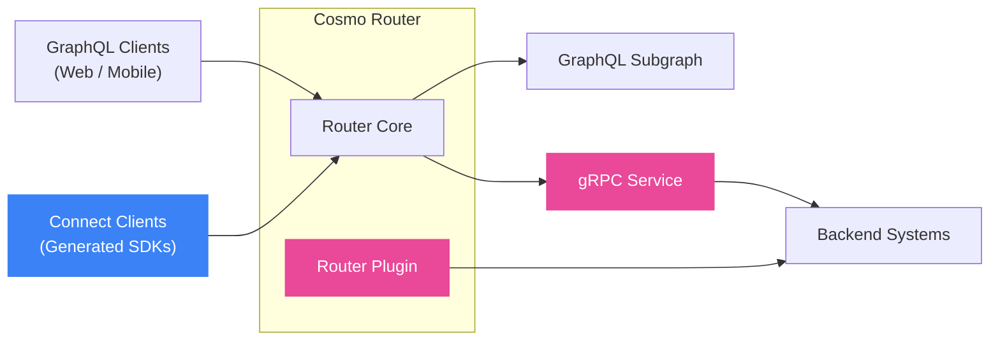

## Cosmo Connect

Cosmo Connect lets you build and consume federated GraphQL without requiring everyone to learn GraphQL. Backend teams can integrate services using familiar RPC patterns, while frontend teams can use generated, type-safe SDKs instead of writing GraphQL queries.

### The Challenge

GraphQL adoption often faces two key barriers:

1. **Learning curve** - Requiring every developer to learn GraphQL concepts, schema design, and query optimization slows adoption
2. **Migration complexity** - Rewriting existing backend services to adopt GraphQL-native patterns is rarely practical for mature architectures

### The Solution

Cosmo Connect removes these barriers by letting teams work with familiar tools:

- **Backend teams** can implement federated subgraphs using standard gRPC instead of GraphQL resolvers
- **Frontend teams** can use type-safe RPC clients instead of writing GraphQL queries
- **The Router** handles all GraphQL complexity as a protocol mediation layer

## What You Can Build

<CardGroup cols={3}>
  <Card title="Connect RPC Clients" icon="mobile" href="/connect/client">
    Generate type-safe SDKs from GraphQL operations.
  </Card>
  <Card title="Connect gRPC Services" icon="server" href="/connect/grpc-services">
    Build federated subgraphs using standard gRPC instead of GraphQL resolvers.
  </Card>
  <Card title="Connect Router Plugins" icon="plug" href="/connect/plugins">
    Extend the router with gRPC services that run as managed local processes.
  </Card>
</CardGroup>

## Architecture

The diagram shows how Cosmo Connect integrates with your existing architecture. Traditional GraphQL clients and Connect-generated clients both communicate with the Router, which federates queries across GraphQL subgraphs, gRPC services, and router plugins.

## Getting Started

Choose your path based on what you want to build:

<CardGroup>
  <Card title="Deploy Your First gRPC Service" icon="code" href="/tutorial/grpc-service-quickstart" horizontal>
    Learn how to integrate a gRPC service into your Cosmo Router.
  </Card>
  <Card title="Deploy Your First Router Plugin" icon="plug" href="/tutorial/using-grpc-plugins" horizontal>
    Learn how to use gRPC plugins with Cosmo Cloud & Cosmo Router.
  </Card>
</CardGroup>

<Card
  title="Advanced gRPC Plugin Demo"
  icon="link"
  href="https://github.com/wundergraph/cosmo-plugin-demo"
  arrow="true"
  cta="Open on GitHub"
>
  Explore a full example that embeds a Users service as a Router plugin and composes with a standalone Products subgraph.
</Card>
