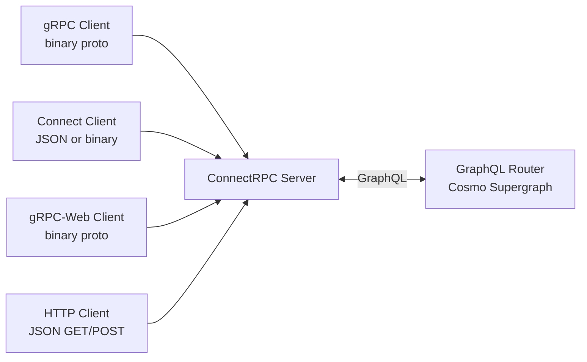
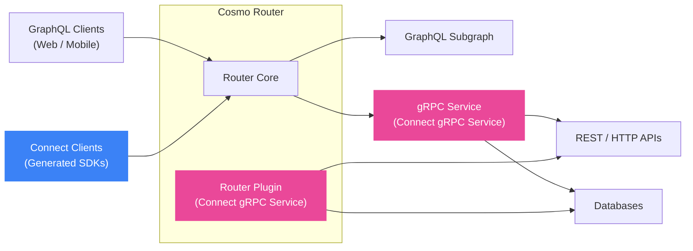

## Cosmo Connect

Cosmo Connect lets backend teams participate in a federated GraphQL architecture without learning, writing, or
operating GraphQL. Backend services integrate into the graph by implementing RPC stubs, while frontend teams and API
consumers interact with the graph through generated, type-safe, versioned SDKs or OpenAPI—without writing GraphQL
queries.

### The Challenge

One of the biggest barriers to GraphQL adoption is the learning curve. While GraphQL offers tremendous benefits for API
composition and flexibility, requiring every developer to learn GraphQL concepts, schema design, and query optimization
can slow down adoption and create friction across an organization.

At the same time, fully realizing the benefits of GraphQL often implies deep changes to existing systems. Rewriting
or restructuring an entire backend stack to adopt GraphQL-native patterns is rarely practical for mature architectures
built around existing services, protocols and team boundaries.

### The Solution

Cosmo Connect solves this problem by providing two complementary capabilities:

1. **Connect gRPC Subgraphs** - Backend teams can implement federated subgraphs using standard gRPC instead of GraphQL
resolvers
2. **Connect RPC** - API consumers can use type-safe RPC clients instead of writing GraphQL queries

The Router handles all GraphQL complexity, acting as a protocol mediation layer between familiar RPC interfaces and
your GraphQL supergraph.

## Key Capabilities

### Connect gRPC Services (gRPC Subgraphs)

Implement Federated Subgraphs using gRPC instead of GraphQL resolvers.

- **No GraphQL servers required**: Backend teams implement standard gRPC services
- **Language flexibility**: Use any language with gRPC support (Go, Java, Rust, C#, etc.)
- **Reduced complexity**: The Router handles query planning; your service handles simple RPCs
- **Familiar patterns**: Use protobuf definitions and standard gRPC tooling

**How it works**: Define an Apollo-compatible Subgraph Schema, compile it into a protobuf definition using the `wgc`
CLI, and implement it in your favorite gRPC stack. No specific framework or GraphQL knowledge is required—it's really
just gRPC!

### Connect RPC (Typed Clients)

Generate OpenAPI Specifications and client SDKs from your GraphQL operations without writing GraphQL queries.

- **Type Safety**: Generate SDKs for iOS, Android, Web, and Backend services using standard protobuf tooling
- **OpenAPI Support**: Generate OpenAPI 3.0 specifications for REST-like documentation and tooling
- **Multi-Protocol**: Use gRPC, Connect, gRPC-Web, or plain HTTP/JSON
- **No GraphQL Required**: API consumers never need to learn GraphQL query syntax
- **Governed API Products**: Distribute versioned proto files as API products via Git, developer portals, or schema
registries

**How it works**: Define GraphQL operations (Trusted Documents), generate protobuf service definitions using the `wgc`
CLI, and distribute proto files to consumers who generate type-safe clients in their preferred language.

#### Architecture

The ConnectRPC server in the Cosmo Router supports multiple client protocols, allowing you to consume your GraphQL API
using various RPC and HTTP protocols:

This architecture enables clients to use their preferred protocol while the Router handles translation to GraphQL
operations.

## Deployment Models

Cosmo Connect supports three main integration patterns:

1.  **[Connect RPC](/connect/client)** — Generated clients that speak the Connect protocol to the Router.
2.  **[Router Plugins](/connect/plugins)** — gRPC services running as local processes managed by the router.
3.  **[gRPC Services](/connect/grpc-services)** — Independent gRPC services implementing subgraphs.

Both plugin and service approaches remove the need to build GraphQL servers while maintaining the benefits of federation. Connect Client removes the need to manually write GraphQL queries in your application code.

## Implementation Docs

The following documentation explains how to build and deploy services and plugins:

- **[Connect RPC](/connect/client)** — Generate type-safe clients and OpenAPI specs from GraphQL operations.
- **[Router Plugins](/router/gRPC/plugins)** — Documentation for developing, configuring, and deploying plugins that run inside the router  
- **[gRPC Services](/router/gRPC/grpc-services)** — Documentation for the complete lifecycle of building, deploying, and managing independent gRPC services  

These docs assume you're familiar with the concepts above and are ready to implement your first service or plugin.

## Getting Started

The following tutorials walk you through step-by-step examples of building your first integration. 
Unlike the implementation docs, which cover the full technical reference, these focus on quick setup and hands-on learning:

<CardGroup>
  <Card title="Deploy Your First gRPC Service" icon="code" href="/tutorial/grpc-service-quickstart" horizontal>
    Learn how to integrate a gRPC service into your Cosmo Router.
  </Card>
  <Card title="Deploy Your First Router Plugin" icon="plug" href="/tutorial/using-grpc-plugins" horizontal>
    Learn how to use gRPC plugins with Cosmo Cloud & Cosmo Router.
  </Card>
</CardGroup>

<Card
  title="Advanced gRPC Plugin Demo"
  icon="link"
  href="https://github.com/wundergraph/cosmo-plugin-demo"
  arrow="true"
  cta="Open on GitHub"
>
  Explore a full example that embeds a Users service as a Router plugin and composes with a standalone Products subgraph.
</Card>
