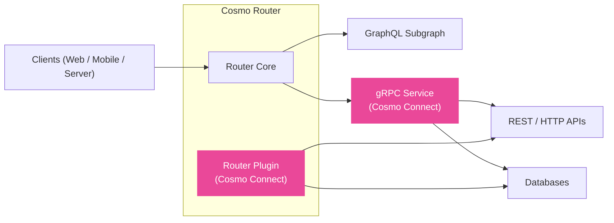

## Cosmo Connect

Cosmo Connect allows you to use GraphQL Federation without requiring backend teams to run GraphQL servers or frameworks.

One of the biggest downsides of Apollo Federation is that backend developers must adopt GraphQL and migrate their existing REST or gRPC services to a Federation-compatible framework. Cosmo Connect solves this problem by compiling GraphQL into gRPC and moving the complexity of the query language into the Router (API Gateway).

How does this work? You define an Apollo-compatible Subgraph Schema, compile it into a protobuf definition, and implement it in your favorite gRPC stack, such as Go, Java, C#, or many others. No specific framework or GraphQL knowledge is required. It is really just gRPC!

## Key Capabilities

### Connect Backend (gRPC Subgraphs)

Implement Federated Subgraphs using gRPC instead of GraphQL resolvers.
- **No GraphQL servers required**: Backend teams implement standard gRPC services.
- **Language flexibility**: Use any language with gRPC support (Go, Java, Rust, C#, etc.).
- **Reduced complexity**: The Router handles query planning; your service handles simple RPCs.

### Connect Client (Typed Clients)

Generate type-safe clients from your GraphQL operations.
- **Type Safety**: Generate SDKs for iOS, Android, Web, and Backend services.
- **OpenAPI**: Generate OpenAPI specs from your GraphQL operations.
- **Performance**: Use the efficient Connect/gRPC protocol to talk to your GraphQL API.

## Deployment Models

Cosmo Connect supports two ways to integrate gRPC into your federated graph:

- **[Router Plugins](/connect/plugins)** — run as local processes managed by the router. Ideal for simple deployments where you want the lowest latency and do not need separate CI/CD or scaling.  
- **[gRPC Services](/connect/grpc-services)** — independent deployments in any language. Suitable when you need full lifecycle control, team ownership boundaries, and independent scaling.

Both approaches remove the need to build GraphQL servers while maintaining the benefits of federation.

## Implementation Docs

The following documentation explains how to build and deploy services and plugins:

- **[Connect Client](/connect/client)** — Generate type-safe clients and OpenAPI specs from GraphQL operations.
- **[Router Plugins](/router/gRPC/plugins)** — Documentation for developing, configuring, and deploying plugins that run inside the router  
- **[gRPC Services](/router/gRPC/grpc-services)** — Documentation for the complete lifecycle of building, deploying, and managing independent gRPC services  

These docs assume you're familiar with the concepts above and are ready to implement your first service or plugin.

## Getting Started

The following tutorials walk you through step-by-step examples of building your first integration. 
Unlike the implementation docs, which cover the full technical reference, these focus on quick setup and hands-on learning:

<CardGroup>
  <Card title="Deploy Your First gRPC Service" icon="code" href="/tutorial/grpc-service-quickstart" horizontal>
    Learn how to integrate a gRPC service into your Cosmo Router.
  </Card>
  <Card title="Deploy Your First Router Plugin" icon="plug" href="/tutorial/using-grpc-plugins" horizontal>
    Learn how to use gRPC plugins with Cosmo Cloud & Cosmo Router.
  </Card>
</CardGroup>

<Card
  title="Advanced gRPC Plugin Demo"
  icon="link"
  href="https://github.com/wundergraph/cosmo-plugin-demo"
  arrow="true"
  cta="Open on GitHub"
>
  Explore a full example that embeds a Users service as a Router plugin and composes with a standalone Products subgraph.
</Card>
