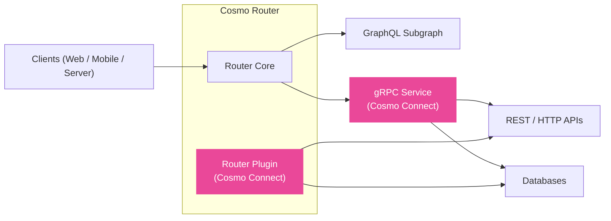

## Cosmo Connect

Cosmo Connect allows you to use GraphQL Federation without requiring backend teams to run GraphQL servers or frameworks.

One of the biggest downsides of Apollo Federation is that backend developers must adopt GraphQL and migrate their existing REST or gRPC services to a Federation-compatible framework. Cosmo Connect solves this problem by compiling GraphQL into gRPC and moving the complexity of the query language into the Router (API Gateway).

How does this work? You define an Apollo-compatible Subgraph Schema, compile it into a protobuf definition, and implement it in your favorite gRPC stack, such as Go, Java, C#, or many others. No specific framework or GraphQL knowledge is required. It is really just gRPC!

## Key Benefits

* **All Cosmo platform benefits** — including breaking change detection, centralized telemetry, and governance out of the box
* **Federation without GraphQL servers** — backend teams implement gRPC contracts instead of GraphQL resolvers
* **Language flexibility** — leverage gRPC code generation across nearly all ecosystems, including those with poor GraphQL server libraries
* **Reduced migration effort** — wrap existing APIs (like REST or SOAP) without writing full subgraphs, lowering the cost of moving from monoliths to federation
* **Developer experience** — straightforward request/response semantics, with the router handling GraphQL query planning and batching

## Deployment Models

Cosmo Connect supports two ways to integrate gRPC into your federated graph:

- **[Router Plugins](/connect/plugins)** — run as local processes managed by the router. Ideal for simple deployments where you want the lowest latency and do not need separate CI/CD or scaling.  
- **[gRPC Services](/connect/grpc-services)** — independent deployments in any language. Suitable when you need full lifecycle control, team ownership boundaries, and independent scaling.

Both approaches remove the need to build GraphQL servers while maintaining the benefits of federation.

## Implementation Docs

The following documentation explains how to build and deploy services and plugins:

- **[Router Plugins](/router/grpc/plugins)** — Documentation for developing, configuring, and deploying plugins that run inside the router  
- **[gRPC Services](/router/grpc/grpc-services)** — Documentation for the complete lifecycle of building, deploying, and managing independent gRPC services  

These docs assume you're familiar with the concepts above and are ready to implement your first service or plugin.

## Getting Started

The following tutorials walk you through step-by-step examples of building your first integration. 
Unlike the implementation docs, which cover the full technical reference, these focus on quick setup and hands-on learning:

<CardGroup>
  <Card title="Deploy Your First gRPC Service" icon="code" href="/tutorial/grpc-service-quickstart" horizontal/>
  <Card title="Deploy Your First Router Plugin" icon="plug" href="/tutorial/using-grpc-plugins" horizontal/>
</CardGroup>
