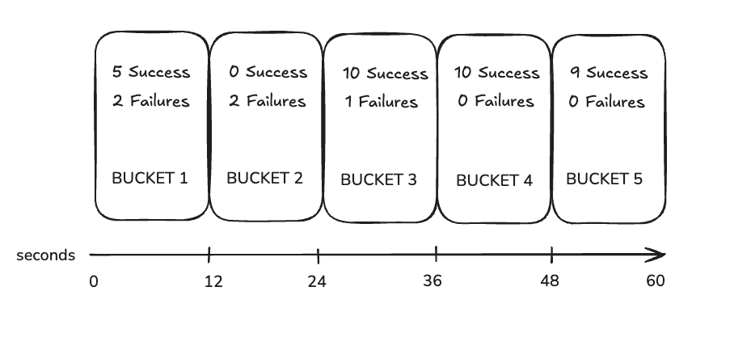
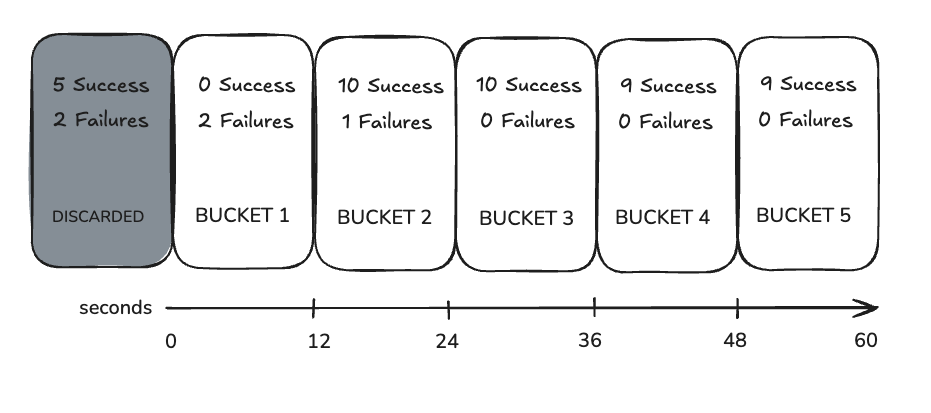
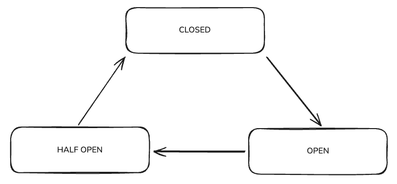

A **circuit breaker** is a reliability pattern that prevents cascading failures in distributed systems. Think of it like an electrical circuit breaker in your home—when there's a problem, it automatically cuts off the connection to prevent damage.

When a subgraph or upstream service starts failing, the circuit breaker stops sending requests to it temporarily. This gives the failing service time to recover while protecting your router from wasting resources on requests that will likely fail. The result is that your router responds faster to clients and maintains stability during partial outages.

## How It Works

### Circuit Breaker Grouping

Circuit breakers are created and managed based on unique URLs. Each unique full URL, including the complete path, gets its own dedicated circuit breaker. This means that multiple subgraphs sharing the same URL will also share the same circuit breaker instance. However, there's an important exception to this rule: if a subgraph has its own specific circuit breaker configuration defined, it will get a dedicated circuit breaker even when sharing a URL with other subgraphs.

### Time-Based Sliding Window

The circuit breaker uses a sophisticated time-based sliding window with buckets to track request statistics over time. When you configure the circuit breaker with `num_buckets` set to 5 and `rolling_duration` set to 60 seconds, the router creates 5 buckets of 12 seconds each (calculated as 60 divided by 5). This bucketing system allows for granular tracking of request patterns and outcomes.

When you make a request, the router records both the request itself and its outcome—whether it succeeded or failed—in the current time bucket. The circuit breaker then continuously evaluates error rates and request counts across all active buckets within the specified rolling duration.

After 60 seconds have elapsed, the circuit breaker has collected a full window of data across all 5 buckets, as illustrated in the diagram below:



With this data collection system in place, the circuit breaker can answer critical questions about the health of your subgraphs. It can determine how many requests have failed versus succeeded, whether the minimum request threshold has been met, what the current error rate is, and most importantly, whether the circuit should open to protect the system from further failures.

As time progresses, the sliding window continues to move forward. After another 12 seconds pass, you can see what happens in the next diagram:



Notice how the oldest bucket gets discarded as new data comes in. The circuit breaker only keeps statistics for the most recent buckets within the rolling window, ensuring that decisions are based on current system behavior rather than stale historical data.

### Circuit Breaker States

The circuit breaker operates in three distinct states, each serving a specific purpose in the failure detection and recovery process:



**Closed State (Normal Operation)**: In this state, the subgraph is considered healthy and functioning normally. All requests pass through to the subgraph without any interference from the circuit breaker. However, the circuit breaker continues to monitor error rates and request patterns in the background.

**Open State (Protection Mode)**: When the subgraph becomes unhealthy and meets the failure criteria, the circuit breaker transitions to the open state. In this protective mode, all incoming requests are immediately rejected without even being sent to the subgraph. This behavior serves two important purposes: it prevents the failing subgraph from being overwhelmed with additional requests that would likely fail, and it allows your router to respond quickly to clients instead of waiting for timeouts. The circuit remains in this state for the duration specified by the `sleep_window` configuration.

**Half-Open State (Testing Recovery)**: After the sleep window expires, the circuit breaker enters a cautious testing phase called the half-open state. During this phase, the circuit breaker allows a limited number of test requests (defined by `half_open_attempts`) to pass through to the subgraph. The purpose is to probe whether the subgraph has recovered and is ready to handle traffic again. Based on the results of these test requests, the circuit breaker will either close (if enough requests succeed as defined by `required_successful`) or return to the open state if the requests continue to fail.

### State Transition Logic

The circuit breaker's state transitions follow a carefully designed logic that balances protection with availability.

**Transition from Closed to Open**: The circuit breaker will only transition from closed to open when both of two critical conditions are met simultaneously. First, the minimum number of requests specified by `request_threshold` must have been received within the rolling window. Second, the error rate must exceed the percentage defined by `error_threshold_percentage`. This dual-condition approach is crucial because it prevents the circuit from opening due to a few isolated failures when there isn't enough data to make a reliable decision. For example, even if you have a 100% error rate, the circuit won't open until the request threshold is met, preventing premature circuit opening during low-traffic periods.

**Transition from Open to Half-Open**: This transition happens automatically after the `sleep_window` duration expires. The circuit breaker doesn't require any external trigger—it simply moves to the half-open state to begin testing whether the downstream service has recovered.

**Transition from Half-Open to Closed or Open**: From the half-open state, the circuit can transition in two directions. If the required number of successful requests (as defined by `required_successful`) are achieved during the testing phase, the circuit transitions back to closed, allowing normal traffic flow to resume. However, if any of the test requests fail, the circuit immediately returns to the open state and waits for another sleep window before attempting to test recovery again.

## Example YAML Configuration

```yaml
traffic_shaping:
  all:
    circuit_breaker:
      enabled: true
      request_threshold: 20           # Need 20+ requests before evaluating
      error_threshold_percentage: 50  # Open circuit at 50% error rate
      sleep_window: 30s               # Block requests for 30 seconds
      half_open_attempts: 5           # Allow 5 test requests
      required_successful: 3          # Need 3 successes to close circuit
      rolling_duration: 60s           # 60-second evaluation window
      num_buckets: 10                 # 10 buckets = 6 seconds per bucket
      execution_timeout: 60s          # Max time before marking as error
  subgraphs:
    employees:
      circuit_breaker:
        enabled: false  # Disable for this specific subgraph
    products:
      circuit_breaker:
        enabled: true
        request_threshold: 30         # Override global setting
```

## Configuration Options

**`enabled`** (boolean) - default: `false`

This setting controls whether the circuit breaker is active for the target scope, whether that's all subgraphs or a specific subgraph. When disabled, requests flow through normally without any circuit breaker intervention.

**`request_threshold`** (integer) - default: `20`

This setting defines the minimum number of requests that must be received before the circuit breaker will evaluate error rates for potential state transitions. This threshold is crucial for preventing the circuit from opening due to a few random failures when there isn't sufficient data to make a reliable decision about the subgraph's health. The circuit breaker needs adequate statistical data to distinguish between temporary glitches and genuine service degradation.

**`error_threshold_percentage`** (integer) - default: `50`

This represents the percentage of failed requests within the rolling window that will trigger the circuit to open. For example, with a 50% threshold and 100 total requests in the window, the circuit will open when 50 or more requests fail. This percentage-based approach allows the circuit breaker to adapt to different traffic volumes while maintaining consistent failure detection sensitivity.

**`sleep_window`** (duration) - default: `5s`

This setting determines how long the circuit will block all requests after transitioning to the open state. The sleep window serves a critical purpose: it gives the failing service time to recover without being overwhelmed by continued request attempts. The duration should be long enough to allow meaningful recovery but not so long that it unnecessarily impacts user experience during temporary outages.

**`rolling_duration`** (duration) - default: `10s`

This defines the time window for collecting error and request statistics. Only data from within this window influences circuit breaker decisions, ensuring that the circuit responds to current conditions rather than being influenced by historical problems that may have been resolved. For example, with a 60-second rolling duration, only the most recent 60 seconds of request data will be considered when evaluating whether to open or close the circuit.

**`execution_timeout`** (duration) - default: `60s`

This sets the maximum time allocated before marking a request as failed due to timeout. This timeout is specifically for circuit breaker error tracking and operates independently of any actual request timeouts that might be configured elsewhere in your system. It's important to understand that this is purely for circuit breaker bookkeeping—the actual request might still succeed and return a response even if it exceeds this timeout.

**`half_open_attempts`** (integer) - default: `1`

This controls how many test requests are allowed during the half-open state. This parameter represents a strategic trade-off: lower values lead to faster recovery decisions but provide less data for evaluation, while higher values give more confidence in the recovery assessment but slow down the return to normal operation.

**`required_successful`** (integer) - default: `1`

This specifies how many successful requests are needed to close the circuit from the half-open state. This setting works in conjunction with `half_open_attempts` to determine the recovery behavior. Higher values provide more confidence that the service has truly recovered but require more successful requests before normal operation resumes.

**`num_buckets`** (integer) - default: `10`

This determines the number of buckets used for statistics within the rolling window. More buckets provide finer-grained statistics and more precise error rate calculations, but they also consume more memory. The rolling duration must be evenly divisible by the number of buckets—if the modulo operation of `rolling_duration % num_buckets` is not zero, the router will return a configuration error.

**`max_concurrent_requests`** (integer) - default: `-1`

This controls the maximum number of concurrent requests that the circuit breaker will process simultaneously. When set to the default value of -1, there is no limit on concurrent requests. This setting can be useful for protecting downstream services from being overwhelmed even when the circuit is closed.

## Configuration Scopes

### Global Configuration

You can apply circuit breaker settings to all subgraphs by default using the `all` scope in your configuration. This approach provides a consistent baseline protection level across your entire graph:

```yaml
traffic_shaping:
  all:
    circuit_breaker:
      enabled: true
      request_threshold: 20
      error_threshold_percentage: 50
```

### Subgraph-Specific Configuration

Individual subgraphs can have their circuit breaker behavior customized or completely disabled by adding specific configuration blocks. This granular control allows you to tailor protection levels based on the reliability characteristics and criticality of different services:


```yaml
traffic_shaping:
  subgraphs:
    test-service:
      circuit_breaker:
        enabled: false          # If you are using an "all" configuration, this will make sure test-service will not have it's circuit breaker
    another-service:
      circuit_breaker:
        enabled: true
        request_threshold: 10   
        sleep_window: 60s       
```

## Important Considerations

### Retry Interaction

Circuit breakers work in conjunction with the router's retry mechanism, and their interaction is important to understand. When you have retries configured and a circuit opens during the retry attempts for a request, no further retries will be attempted for that specific request.

### Multi-Window Recovery Scenarios

When you configure `half_open_attempts` to be less than `required_successful`, the recovery process will span multiple sleep windows. Consider an example where you have `half_open_attempts` set to 3, `required_successful` set to 5, and `sleep_window` set to 300 milliseconds. In this scenario, when the circuit enters the half-open state, it will allow 3 test requests to pass through. Even if all 3 requests succeed, the circuit still needs 2 more successful requests to meet the `required_successful` threshold. Since the half-open attempts are exhausted, the circuit remains half-open and waits for another sleep window to expire before allowing the next batch of test requests.

### Timeout Behavior

The `execution_timeout` serves as an internal timer specifically for circuit breaker error tracking. When a request exceeds this timeout, it gets marked as an error for circuit breaker statistical purposes. However, it's crucial to understand that the actual request might still succeed and return a response to the client before the circuit breaker trips. This separation allows the circuit breaker to track slow requests as potential indicators of service degradation.

## Monitoring and Observability

Circuit breakers provide metrics for understanding your system's resilience patterns and fine-tuning your configuration. These metrics include detailed information about circuit breaker short circuits and the current status of the circuit breaker.

For more details, see the [circuit breaker-specific metrics](/router/metrics-and-monitoring#circuit-breaker-specific-metrics) documentation. 


