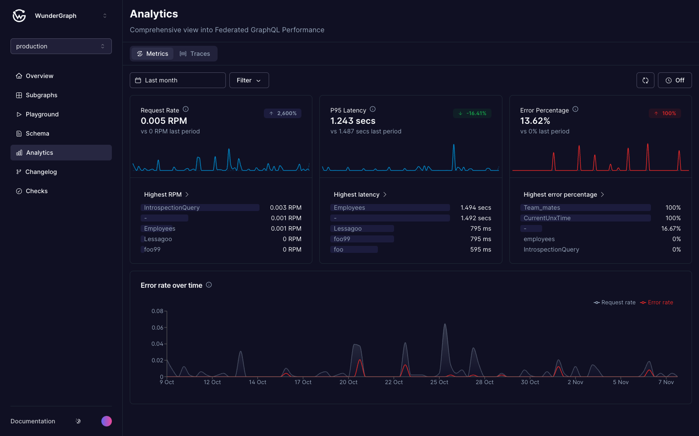

# Metrics

<figure><figcaption>
The metrics overview
</figcaption></figure>

### Request rate

The average requests per minute for the selected time range.

### P95 latency

The average p95 latency for the selected time range.

### Error rate

The average error percentage for the selected time range. This includes 4xx and 5xx errors.

### Error rate over time

The amount of GraphQL requests and errors over time.
