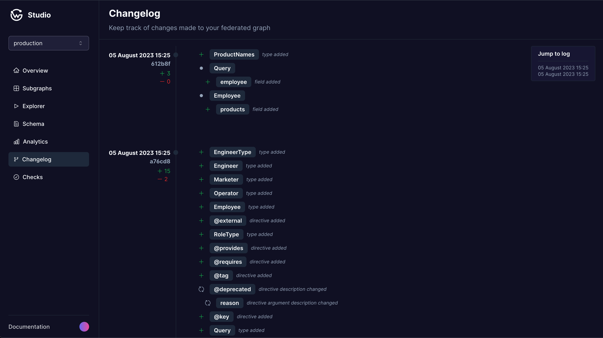

# Changelog

The schema changes are listed in a chronological order, with the most recent changes appearing at the top. Each entry provides specific details about what was added or removed from the schema. This includes changes to types, fields, directives, and any other elements that make up your federated graph's schema.

<figure><figcaption></figcaption></figure>

#### Additions

Additions are denoted in green and detail what elements were added to your federated graph's schema. This could be the addition of a new type, the introduction of a new field within an existing type, or the implementation of new directives. Each addition provides enough detail for you to understand what was introduced and its impact on the overall schema.

#### Deletions

Deletions are denoted in red and detail what elements were removed from your federated graph's schema. This could be the removal of an existing type, the deletion of a field within a type, or the removal of directives. Each deletion provides enough detail for you to understand what was removed and its impact on the overall schema.
