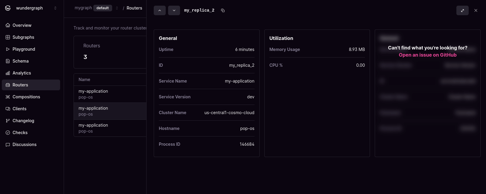

# Cluster Management


Requires a router with version >= 0.64.0


When the router starts, we will periodically send metric data to Cosmo Cloud. We use this information to display all running routers and to evaluate their vitals.

## Routers

<figure><figcaption>
Cluster overview
</figcaption></figure>

The list displays all running router instances. Upon closer inspection, you can verify the currently deployed graph composition and vital metrics such as CPU and memory utilization. Here is a summary of all provided information:

* **Name:** The application name specified under the `telemetry.serviceName` option. By default, it is set to `cosmo-router`. Below with show the `hostname` where the router is running on.
* **Instance ID:** If not specified in the `instance_id` option, a new ID will be generated with each router start. A stable ID ensures that metrics with the same ID are grouped together.
* **Status:** Identify if the server is up and running. In the future, we will conduct advanced validation that takes various metrics into consideration.
* **Version:** The deployed binary version of the router.
* **Cluster:** The logical cluster name. Is specified by the `cluster.name` setting. By default it is an empty string.
* **Uptime:** The duration for which the instance has been up and running.
* **Mem / CPU:** The utilization of the router instance. Arrows signal the trend between two data samples.


If your router fails to push uptime metrics for any reason, the instance will not appear. As long as one metric sample reaches us within 45 seconds, we assume the router is operational.


<figure><figcaption>
Instance details
</figcaption></figure>

If you click on a router instance, a summary displaying all the metrics available for your router instance will be shown. We will reserve this space to add additional metrics and diagrams in the future. If you have any ideas or requirements, please don't hesitate to make a [feature request](https://github.com/wundergraph/cosmo/issues/new?assignees=\&labels=enhancement%2Cneeds+triage\&projects=\&template=feature\_request.yaml).
