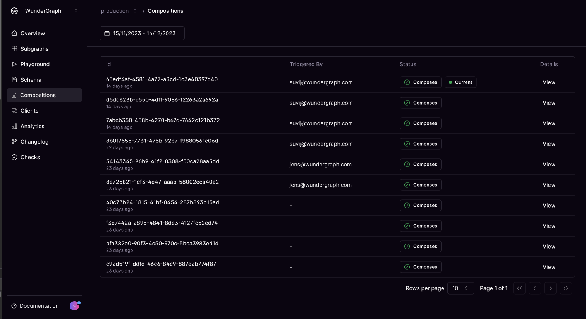
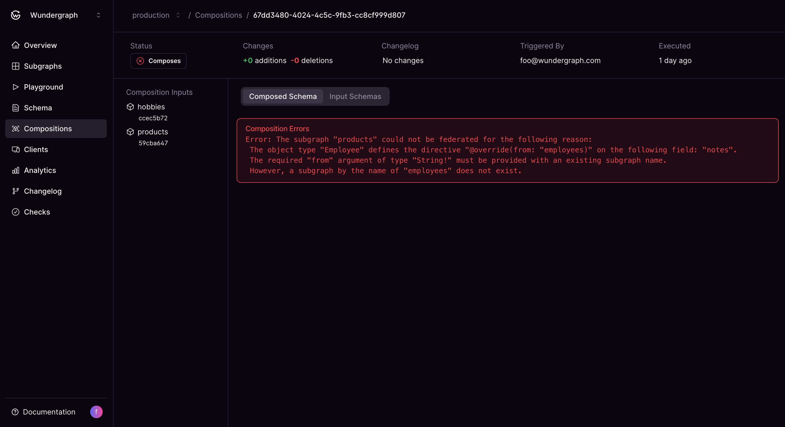

# Compositions

<figure><figcaption></figcaption></figure>

The highlights of the compositions page are as follows:-

* Track the inputs and the errors of every composition.
* Track every version of your composed schema.
* View the changes in the federated graph after each composition.

<figure><figcaption></figcaption></figure>

<figure><figcaption>
Composition errors
</figcaption></figure>

