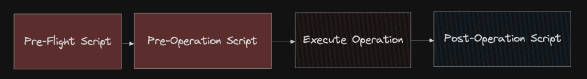

# Discussions

## Starting discussions

Discussions can be created from the schema page of both the graph and subgraph. We use a what-you-see-is-what-you-get (WYSIWYG) editor which supports popular markdown shortcuts.\

<figure><figcaption></figcaption></figure>

### Two way binding

Discussions created in the Explorer and SDL tabs (by clicking on a line number) are binded so you can create and view them in either.&#x20;

<figure><figcaption></figcaption></figure>

 

<figure><figcaption></figcaption></figure>

## Discussions across schema versions

You can create discussions across different schema versions of the graph. Publishing new schemas will not get rid of any discussions. You can view all of them grouped by schema version for each graph or subgraph. You can even compare the schema of the discussion to the latest one.

<figure><figcaption></figcaption></figure>

## Replying, editing and deleting comments

Anyone in the organization can reply to an open discussion. The structure of the thread is flat. You cannot have nested replies.&#x20;

Only the creator of the comment can edit it.&#x20;

Only the creator or an admin can delete a comment. Deleting comments only soft deletes it and will be shown as `This comment was deleted` on the UI.


IMPORTANT: Deleting the opening comment will result in deletion of the discussion


## Resolving discussions

Once you think the discussion has reached a conclusion you can mark the discussion as resolved. You can undo this at anytime. Resolved discussions are closed to further replies unless they are open again.

<figure><figcaption></figcaption></figure>

