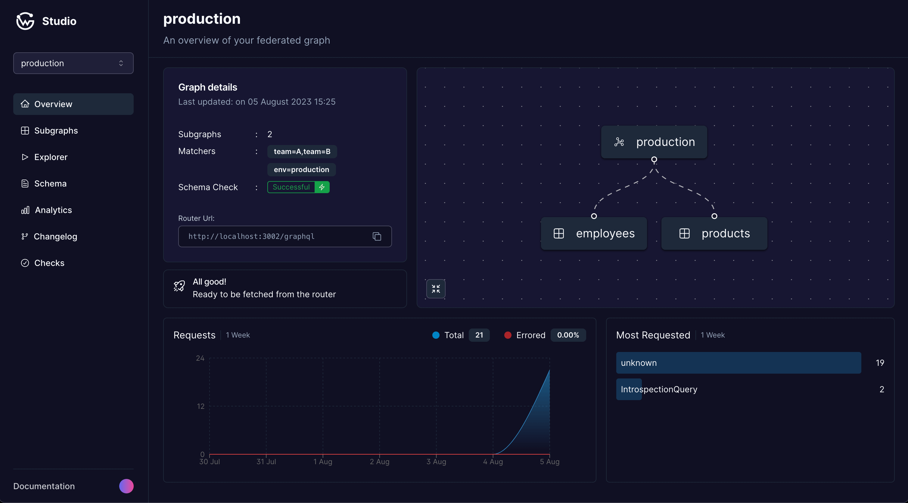

# Overview Page

<figure><figcaption></figcaption></figure>

## Subgraphs

The total number of subgraphs currently existing in your federated graph. Each subgraph represents a portion of your graph's schema. The illustration on the right also shows which subgraphs were federated.

## Label Matchers

The Label Matchers provides information on the labelling system employed within your federated graph. The subgraphs are selected for federation based on these label matchers. Learn more [here](../cli/essentials.md#label-matcher).

## Current Composition Status

This shows the latest status of the composed schema. If there are no errors, the federated graph is ready to be fetched from the server. If not, it will display the error messages stating that the graph needs attention.

## Router URL

The Router URL is the endpoint through which all of your federated graph's operations are accessed. This URL acts as the singular point of interaction for clients, routing requests to appropriate subgraphs based on the incoming operation. It's crucial for client-side developers to know this URL for querying and mutation purposes.

## Weekly Stats

### Total Requests and Errors

This section of the dashboard provides a day-to-day graph of total requests and errors. The total requests metric shows how often your federated graph is accessed. The errors metric shows how often requests to your graph encounter errors. These could be a result of various issues, from server-side problems to incorrect client requests. A sudden increase in errors can be an early warning sign of potential issues that need immediate attention.

### Top 5 Requested Operations

This section provides information on the five most frequently accessed operations in your federated graph over the past week. Understanding the most accessed operations can give you insights into how your users interact with your system. It may also help identify potential areas for optimization, especially if certain operations are causing high load or errors.

The Overview page is your first stop in understanding the overall state of your federated graph. It is the starting point for further diagnostics, and its constant monitoring can help maintain the health of your federated graph and its associated services.
