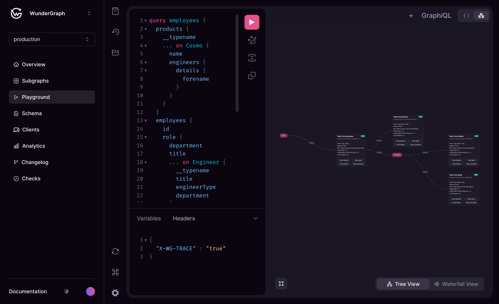
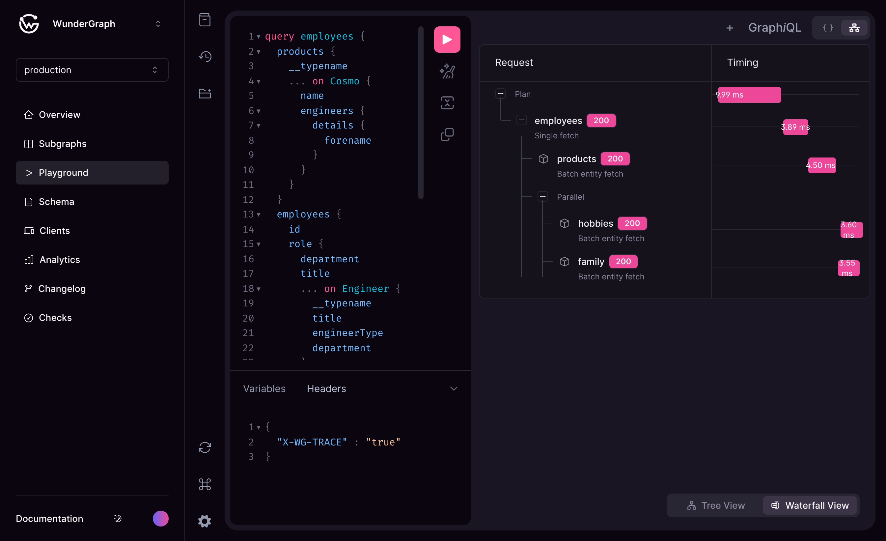

# Playground++

<figure><figcaption>
Enhanced GraphiQL Playground
</figcaption></figure>

The playground is enchanced with visual representations of the query execution plan along with details like timings, inputs outputs for each subgraph and much more. The `X-WG-TRACE` header must be included to enable the visualization. It is available in 2 modes tree view and waterfall view.


For more information about Advanced Request Tracing (ART) click [here](../router/advanced-request-tracing-art.md)


<figure><figcaption>
Waterfall View
</figcaption></figure>

