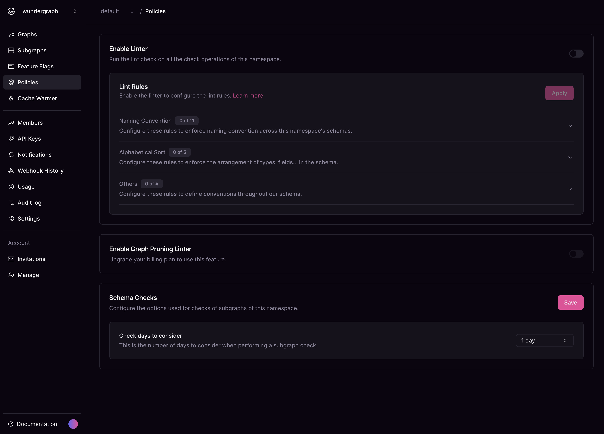

# Policies

## Lint Policy

Schema linting capabilities enable developers to uphold GraphQL schema quality and adhere to established conventions effortlessly. By integrating schema linting into your development workflow, you can ensure consistency, enhance code maintainability, and catch issues early in the development process.

<figure><figcaption></figcaption></figure>

### How to configure schema lintings

* Navigate to the Policies page on Cosmo.
* Select the namespace.

<figure><figcaption></figcaption></figure>

* Enable the linter.
* Configure the lint rules and their respective severity levels once enabled.

Once the linter is enabled and the rules are configured, the lint check will be performed on every [check](../../cli/subgraph/check.md) operation of that namespace.

### Severity Level

* Error:- If any configured rules are violated, it causes the check operation to fail.
* Warning:- If any configured rules are violated, they are flagged as warnings, but they don't cause the check operation to fail.

## Schema Checks

To configure how far back in date the operation checks look at traffic follow these steps:

* Navigate to the Policies page on Cosmo.
* Select the namespace.
* Select the desired timeframe from the **Checks days to consider** dropdown

<figure><figcaption></figcaption></figure>


The limit of days you can configure is directly tied to your plan. If you need a larger range, please upgrade to a higher plan or contact us.

