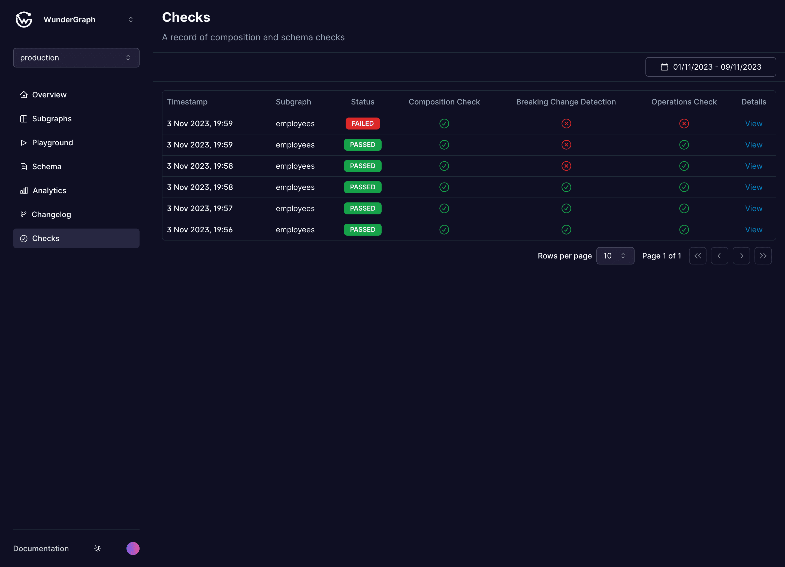
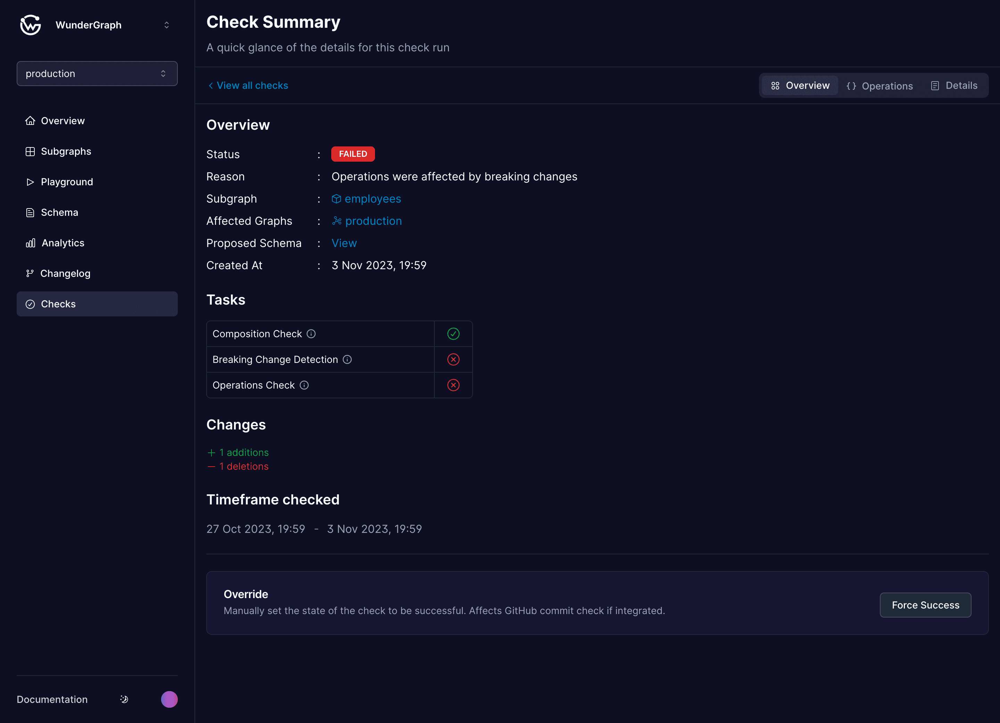
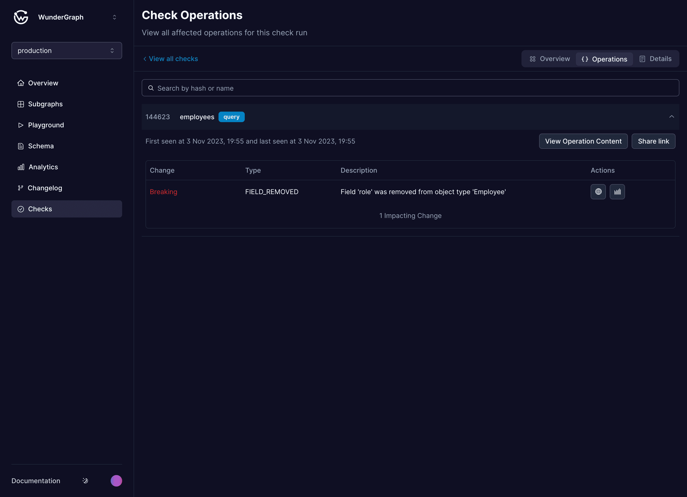
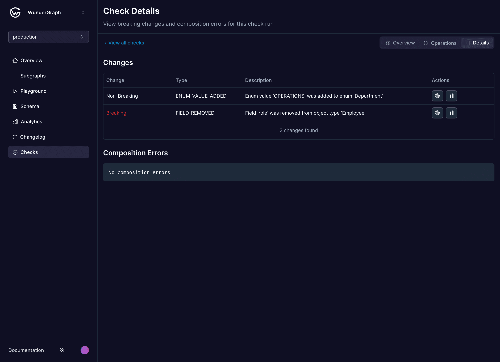

# Schema Checks

A schema check allows you to validate if a proposed schema change will produce any error before shipping it to production. We differentiate between three different kinds of errors:

1. **Composition errors:** Describes if the proposed schema can be composed with all other subgraphs in the federated graph. It will never be possible to publish a schema that has composition errors because it would result in a non-executable plan for the router.
2. **Breaking Change Detection:** Describes if the proposed schema is free of changes that break existing client operations. You can't ship breaking changes except you force them manually through an "Override" or automatically by using "[Operations Check](schema-checks.md#operation-checks)" see below.
3. **Operations Check:** Describes if the proposed schema affects any client operations based on real usage data. This is done by sending schema usage traffic to [Cosmo Cloud](../deployments-and-hosting/cosmo-cloud.md) from your routers. If you propose a breaking change and no active clients use the affected schema changes the check will pass.

You can run schema checks with [`wgc subgraph check`](../cli/subgraph/check.md) in the CI and optionally with native [Github integration](../tutorial/pr-based-workflow-for-federation.md). After you have identified the possible effects of your changes you can publish them to your router with [`wgc subgraph publish`](../cli/subgraph/publish.md)  .

## Check overview

This view lists all the checks performed, showing the timestamp of each check, the status (passed or failed), and whether the proposed schema was both composable and non-breaking. You can use the date picker to browse through the history.

<figure><figcaption>
Checks table
</figcaption></figure>

* **Timestamp**: This column indicates when each check was performed. The most recent checks are displayed at the top.
* **Status**: This column shows the result of the check. A status of "Passed" means that the proposed schema was both composable and non-breaking. A status of "Failed" means that the proposed schema was either not composable, introduced breaking changes, or both.

## Check Page

### Overview

Have a glance at your check. Understand why the check succeeded or failed, and what graphs, operations, and clients were affected.


Operations checks are enabled by default and use the traffic of the last 7 days to validate if a breaking change can be safely published. If you have a more advanced use case, please let us know.


<figure><figcaption></figcaption></figure>

#### Manual overrides

You can force a breaking change to be released even when all checks except composition errors are red. The override requires currently an integration with Github. Please check out our [tutorial](../tutorial/pr-based-workflow-for-federation.md) on how to set this up in a few minutes.

### Operation Checks

Understand which operations and clients are affected by the breaking changes. You can check which ones along all your changes affected that particular operation. Besides that, you can inspect the operation document or share the specific operation with your colleagues.


Operations Check is not performed if there are no breaking changes in your schema.


<figure><figcaption></figcaption></figure>

### Details

View all changes that were proposed by the check including composition errors. Each change is linked to the [schema explorer](schema-explorer.md) and [field usage](analytics/schema-field-usage.md) page. The field usage opened from here by default shows the traffic during the timeframe of the check (7 days).

<figure><figcaption></figcaption></figure>

