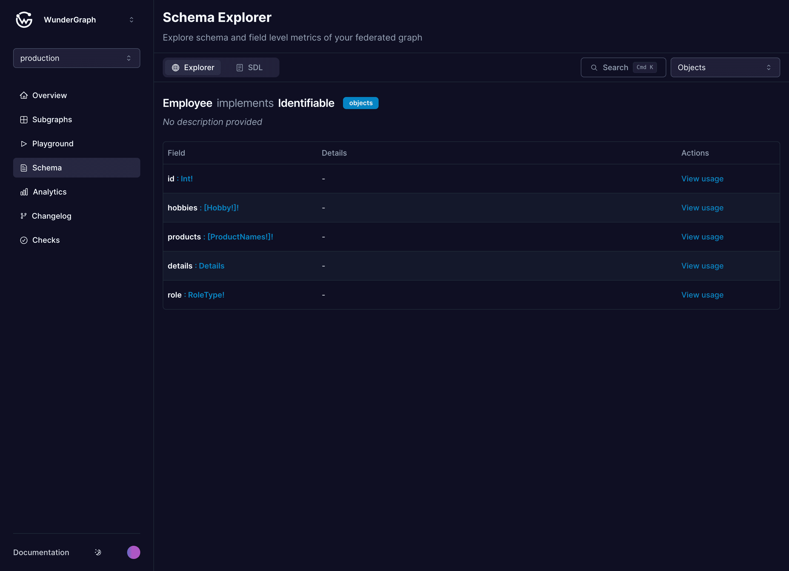

# Schema Explorer

<figure><figcaption></figcaption></figure>

## Navigation

You can navigate to every type you see on the page. From objects that implement interfaces to unions and enums. The details section shows all the inputs for that particular field. If your schema has comments, they would appear here as well.

## Field Usage

Check the docs here to see how the usage for each type looks like


[schema-field-usage.md](analytics/schema-field-usage.md)


## Search

Open the search modal by hitting `Cmd/Ctrl + K` on your keyboard. Jump to any type you like to view.

<figure><figcaption></figcaption></figure>

## Deprecated Fields

You can view all deprecated fields in your schema in one place along with their usage. This helps to determine if it is safe to remove the field/argument.

<figure><figcaption></figcaption></figure>
