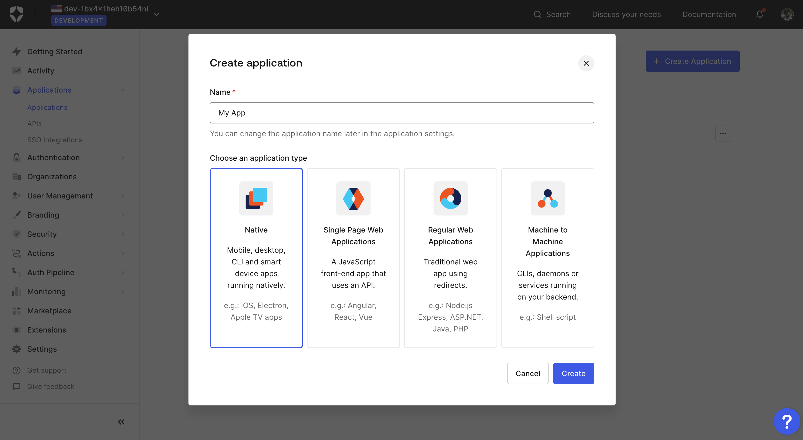
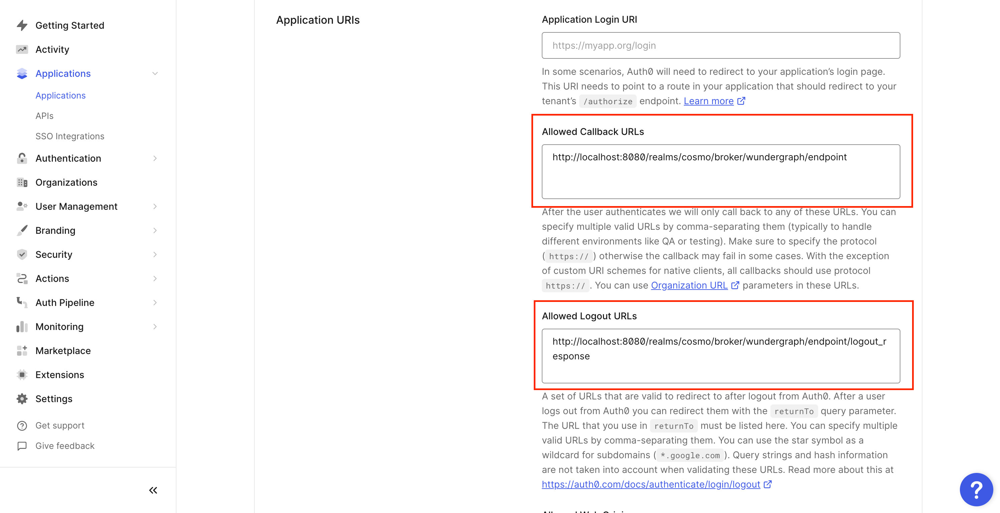
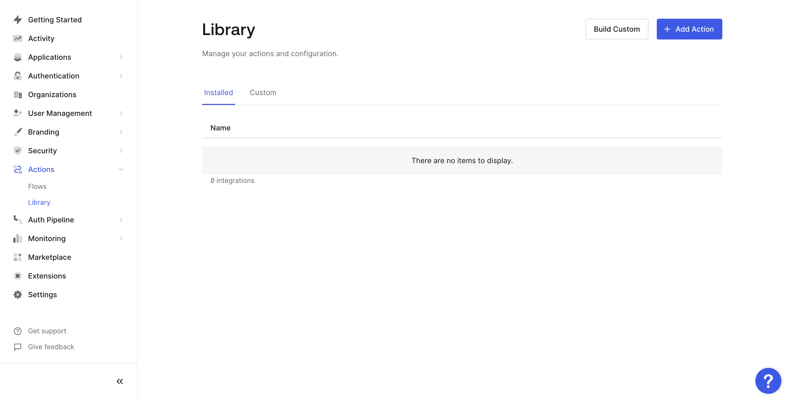
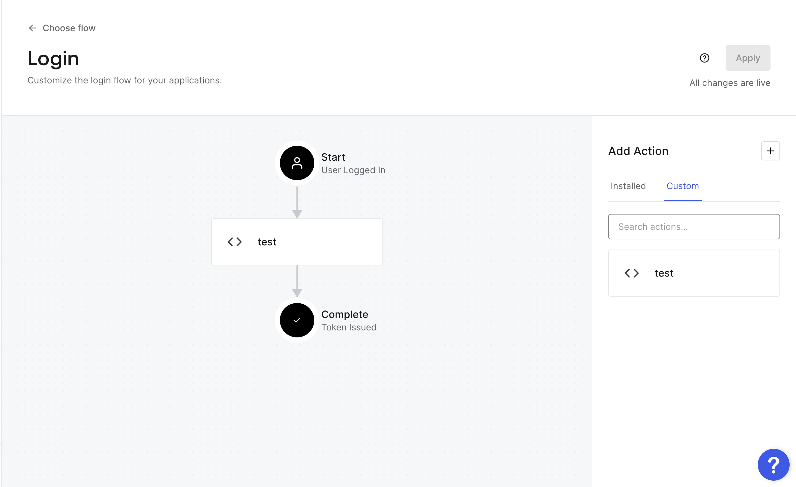

# Auth0

### Steps to set Auth0 as an OIDC identity provider

* Navigate to the Applications view within your Auth0 account.
* Either use the default application or create a new application by clicking on the **Create Application** button.
* A dialog will open, give the app a name, select the type of application and then click on the **Create** button.

<figure><figcaption></figcaption></figure>

* Once the app is created, navigate to the Setting tab. Now copy the **Domain**, **Client ID** and **Client Secret**.

<figure><figcaption></figcaption></figure>

* Navigate to the settings page on Cosmo.
* Click on **Connect.**

<figure><figcaption></figcaption></figure>

* Give the connection a name, the **Discovery Endpoint** will be `https://YOUR_AUTH0_DOMAIN/.well-known/openid-configuration`**,** and paste the **Client ID** and **Client secret** copied before into the **Client ID** and **Client Secret fields respectively,** and then click on **Connect.**

<figure><figcaption></figcaption></figure>

* Configure the mapping between the roles in Cosmo and the user roles in Auth0. The field **Group in the provider** can be populated with the name of the role or a regex to match the user roles. Once all the mappers are configured, click on **Save**.

<figure><figcaption></figcaption></figure>

* Copy the sign-in and sign-out redirect URIs displayed in the dialog.

<figure><figcaption></figcaption></figure>

* Navigate back to the settings tab of the application created on Auth0 and populate the **Allowed Callback URLs** and **Allowed Logout URLs** redirect URIs with the above-copied sign-in and sign-out URLs respectively. Click on **Save Changes**.

<figure><figcaption></figcaption></figure>

* Now navigate to **Actions** -> **Library,** and then click on **the Build Custom** button**.**

<figure><figcaption></figcaption></figure>

* Give the action a name, select **Login/Post Login** as the **Trigger** and **Node 18** as the **Runtime** and then click the **Create** button**.**
* Copy the below code and paste it into the editor shown, then click the **Deploy** button.

```typescript
exports.onExecutePostLogin = async (event, api) => {
  if(event.authorization){
    api.idToken.setCustomClaim(`ssoGroups`, event.authorization.roles);
  }
};
```

* Now navigate to **Actions** -> **Flows,** and then click on the **Login** flow**.**
* Navigate to the **Custom** tab on the right side of the page. Now drag the action and place it between Start and Complete as shown below, and then click on **Apply**.

<figure><figcaption></figcaption></figure>

* Now you can assign users/groups to the application, and those users will be able to log into Cosmo using the URL provided on setting up the provider.
