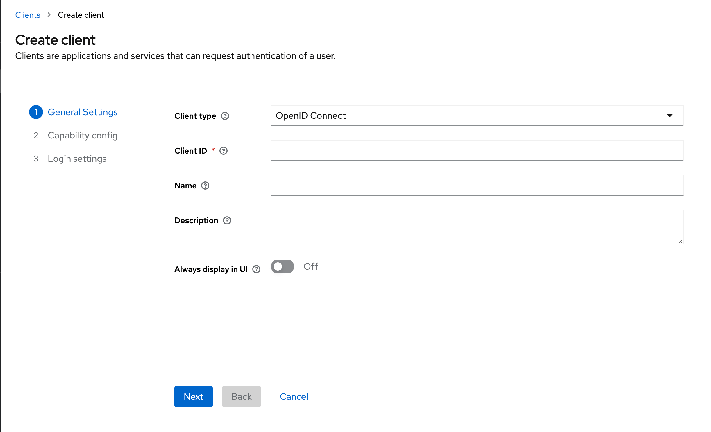
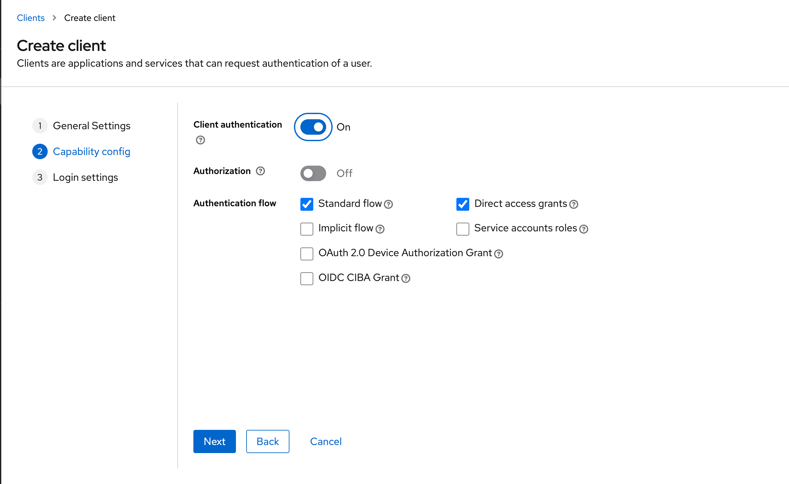
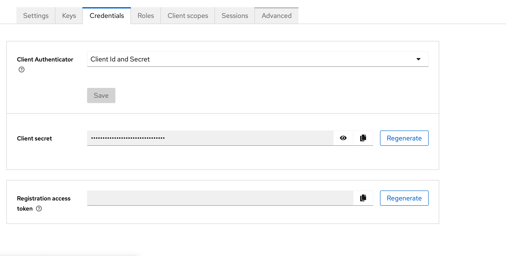
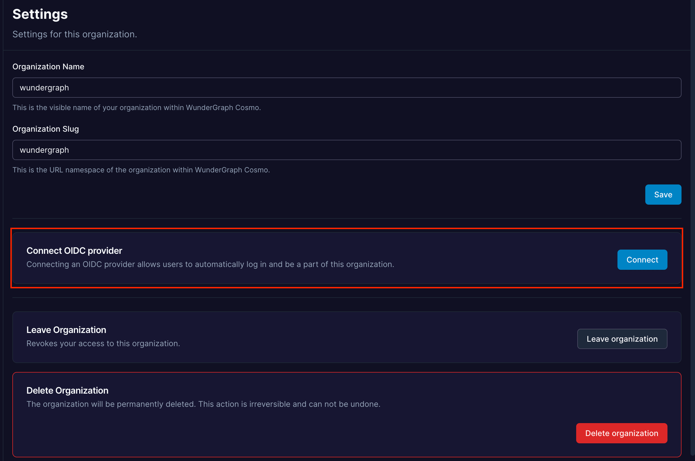
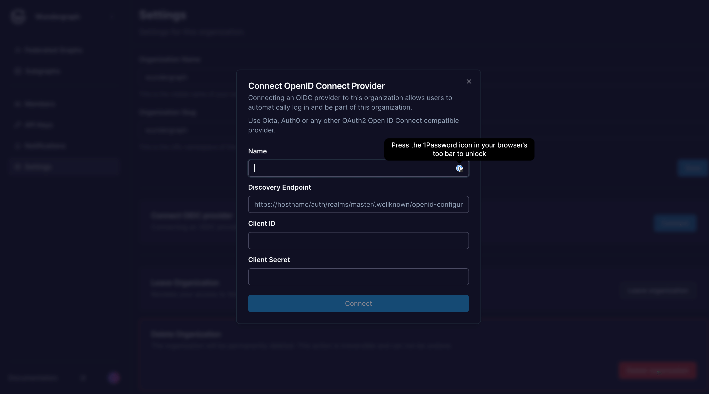
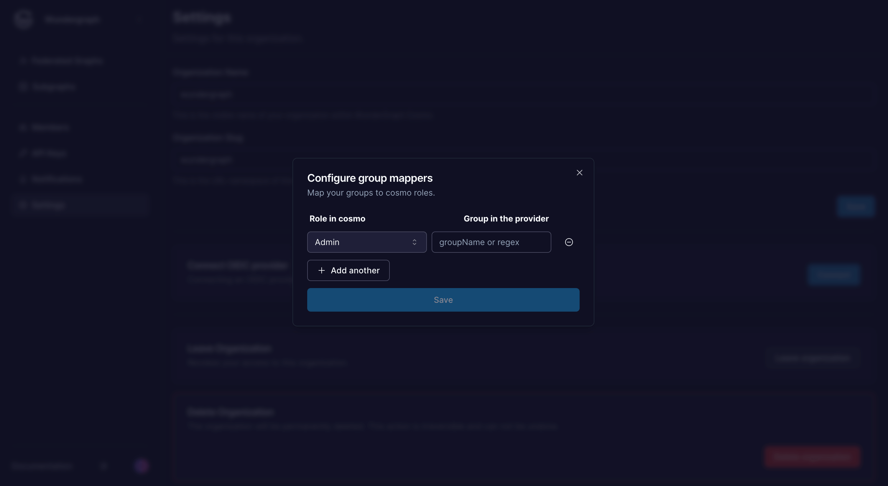
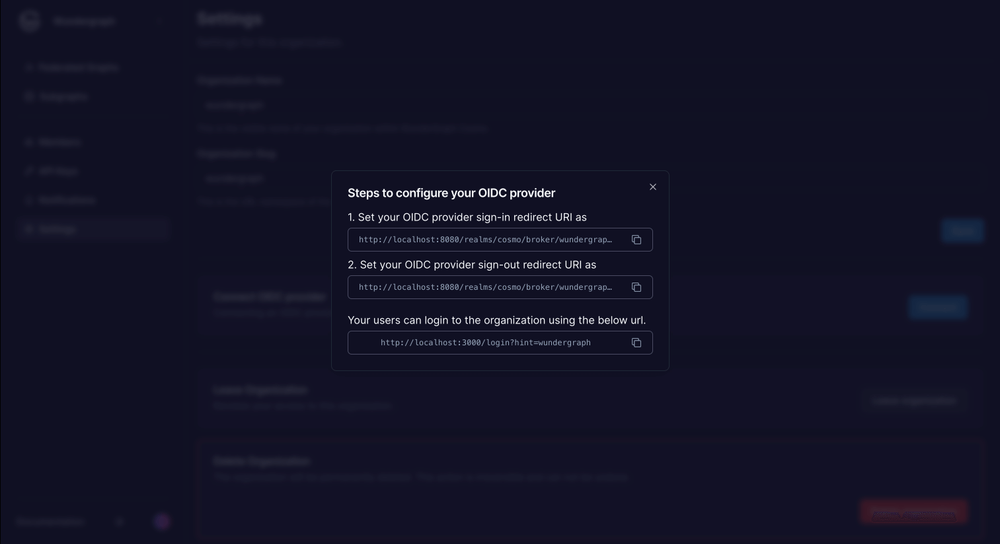
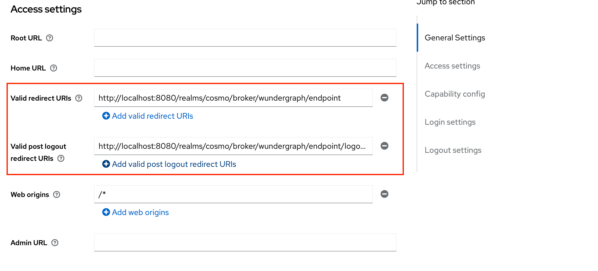
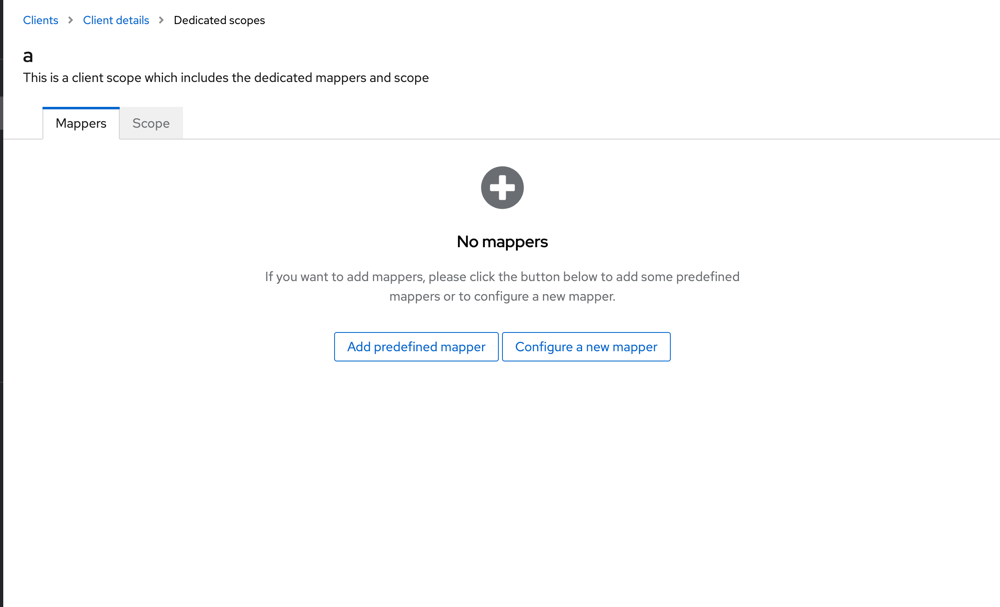
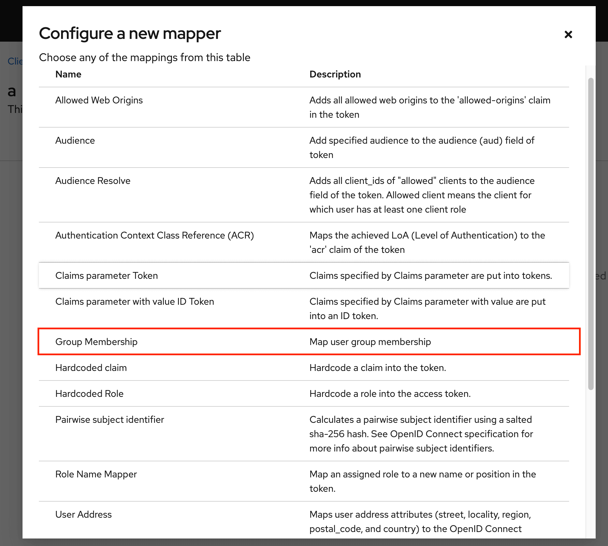

# Keycloak

### Steps to set Keyclaok as an OIDC identity provider

* Navigate to the **Clients** view within your Keyclaok Dashboard.
* Click on **Create Client**.&#x20;
* Select OpenID Connect as the **Client Type, and** give the client a **Client ID** and a **Name** and then click on **Next.**

<figure><figcaption></figcaption></figure>

* Enable **Client authentication,** then click on **Next** and then click on **Save** on the next page**.**

<figure><figcaption></figcaption></figure>

* Navigate to the **Credentials** tab and then copy the **Client Secret.**

<figure><figcaption></figcaption></figure>

* Navigate to the **Realm Settings** and then copy the link of **OpenID Endpoint Configuration.**

<figure><figcaption></figcaption></figure>

* Navigate to the settings page on Cosmo.
* Click on **Connect.**

<figure><figcaption></figcaption></figure>

* Give the connection a name, paste the **OpenID Endpoint Configuration** copied before, into the **Discovery Endpoint,** and paste the **Client ID** and **Client secret** copied before into the **Client ID** and **Client Secret fields respectively,** and then click on **Connect.**

<figure><figcaption></figcaption></figure>

* Configure the mapping between the roles in Cosmo and the user groups in Keycloak. The field **Group in the provider** can be populated with the name of the group or a regex to match the user groups. Once all the mappers are configured, click on **Save**.

<figure><figcaption></figcaption></figure>

* Copy the sign-in and sign-out redirect URIs displayed in the dialog.

<figure><figcaption></figcaption></figure>

* Navigate back to the client created on Keycloak and populate the **Valid redirect URIs** and **Valid post Logout redirect URIs** with the above-copied sign-in and sign-out URLs respectively. Click on **Save**.

<figure><figcaption></figcaption></figure>

* Navigate to the **Client Scopes** tab, click on the first client scope(usually would be ${**clientID}-dedicated**), and then click on **Configure a new mapper.**

<figure><figcaption></figcaption></figure>

* Select **Group Membership.**

<figure><figcaption></figcaption></figure>

* Give the mapper a name, then populate the **Token Claim Name** with **"**ssoGroups**"** and then click on **Save.**
* Now you can assign users/groups to the application, and those users will be able to log into Cosmo using the URL provided on setting up the provider.
