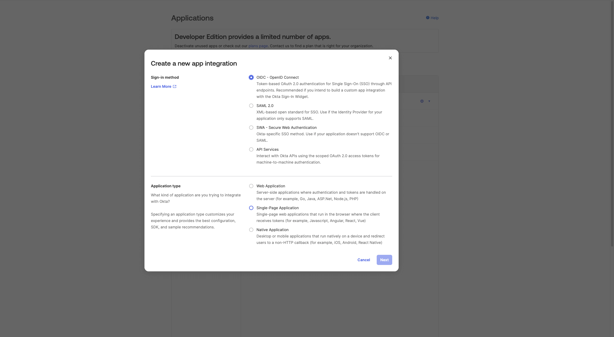
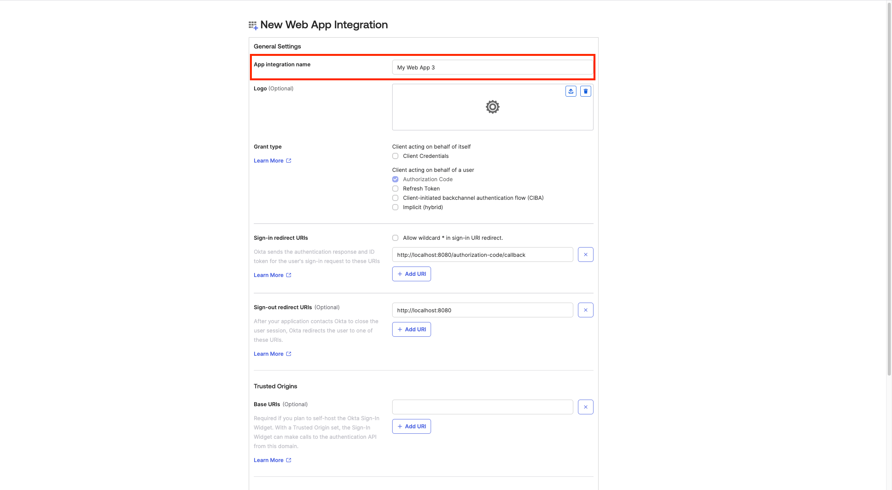
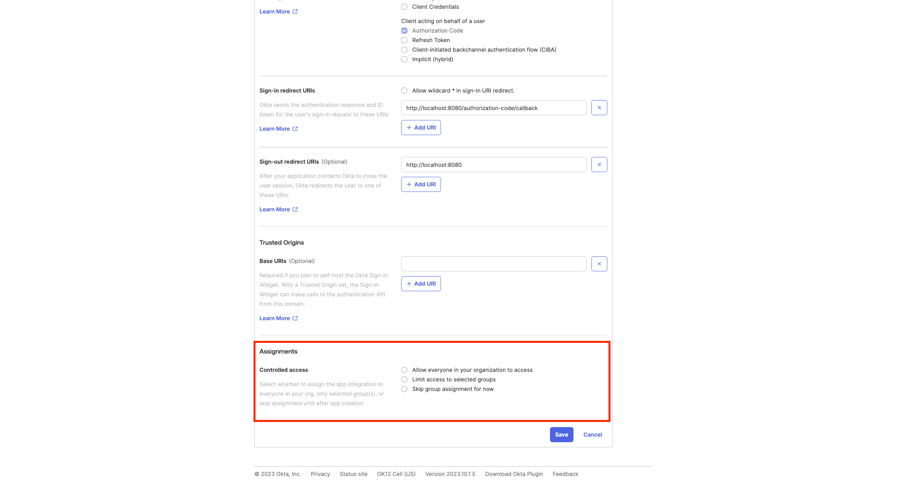
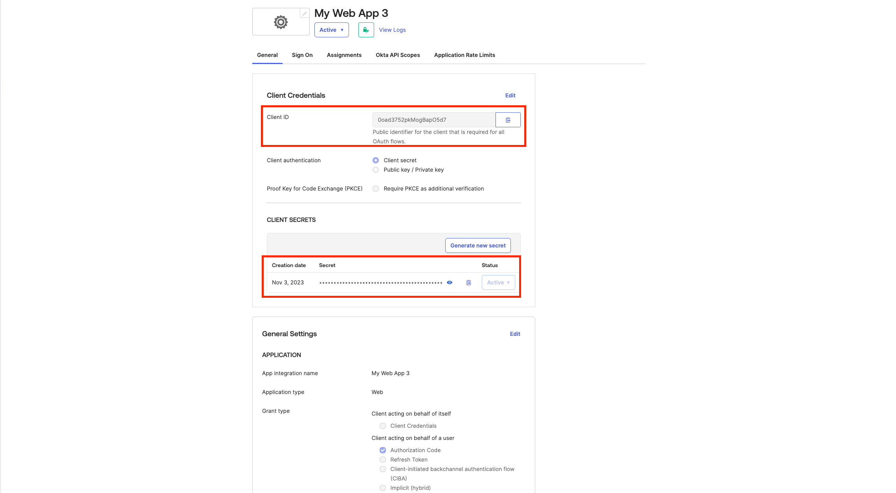
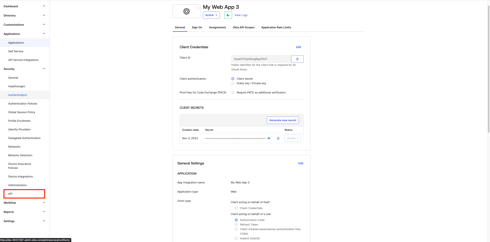
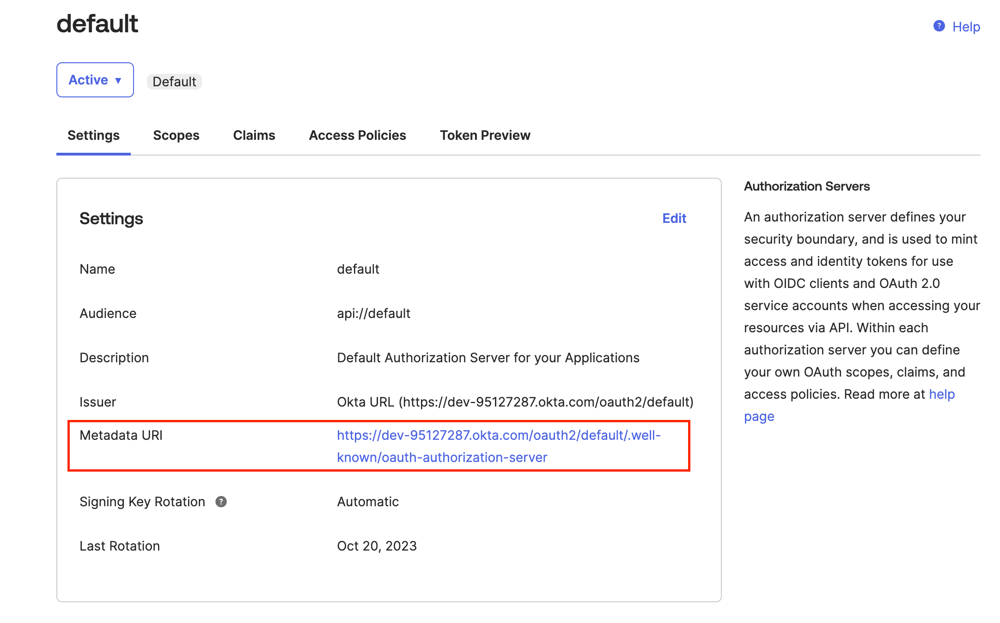
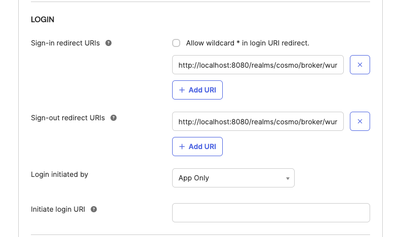
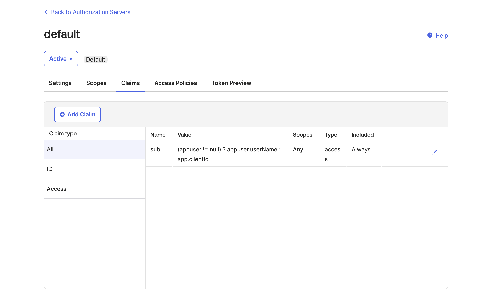
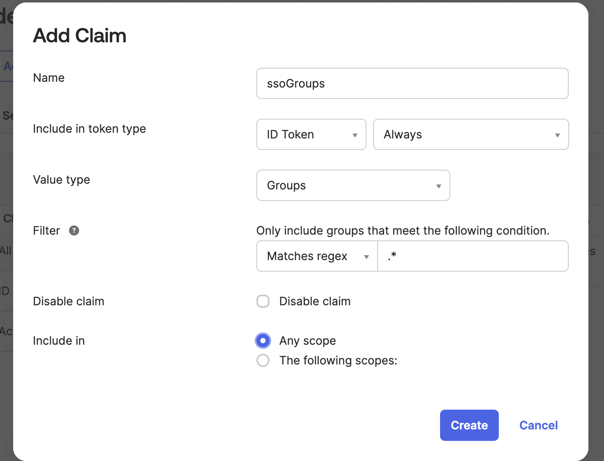

# Okta

Steps to set Okta as an OIDC identity provider

* Navigate to the Applications view within your Okta Administrator Dashboard.
* Click on **Create App Integration**.&#x20;
* A dialog appears, select OIDC - OpenID Connect as the sign-in method.
* Now select the type of application and click on **Next.**

<figure><figcaption></figcaption></figure>

* Now give the app a name and scroll down to **Assignments.**

<figure><figcaption></figcaption></figure>

* For **Grant Type,** keep the defaults.
* For **Assignments, s**elect one of the options based on your choice and then click on **Save.**

<figure><figcaption></figcaption></figure>

* Copy the **Client ID** and **Client Secret.**

<figure><figcaption></figcaption></figure>

* Navigate to Security -> API.

<figure><figcaption></figcaption></figure>

* Select the **default** authorization server.
* Copy the **Metadata URI.**

<figure><figcaption></figcaption></figure>

* Navigate to the settings page on Cosmo.

<figure><figcaption></figcaption></figure>

* Give the connection a name, paste the **Metadata URI** copied before, into the **Discovery Endpoint,** and paste the **Client ID** and **Client secret** copied before into the **Client ID** and **Client Secret fields respectively,** and then click on **Connect.**

<figure><figcaption></figcaption></figure>

* Configure the mapping between the roles in Cosmo and the user groups in Okta. The field **Group in the provider** can be populated with the name of the group or a regex to match the user groups. Once all the mappers are configured, click on **Save**.

<figure><figcaption></figcaption></figure>

* Copy the sign-in and sign-out redirect URIs displayed in the dialog.

<figure><figcaption></figcaption></figure>

* Navigate back to the application created on Okta and populate the Sign-in and Sign-out redirect URIs with the above-copied values. Click on **Save**.

<figure><figcaption></figcaption></figure>

* Navigate to Security-> API, and click on the **default** auth server. Navigate to the **claims** tab and then click on **Add Claim.**

<figure><figcaption></figcaption></figure>

* Name the claim "ssoGroups", and include it in the **ID Token,** for the value type select **Groups,** and for the filter select **Matches regex** and populate the field with **".\*".** Click on **Create.**

<figure><figcaption></figcaption></figure>

* Now you can assign users/groups to the application, and those users will be able to log into Cosmo using the URL provided on setting up the provider.


Please make sure that the users added to the application have a username.

